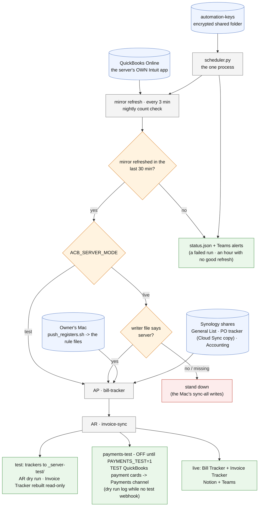

# docker/ - how the office server works

Last changed: 10/07/2026 - **payments-test is OFF** (`PAYMENTS_TEST=1` turns it on) until the base AP/AR run is proven on the server. When on, test mode adds it after AR: `invoice-sync/qbo_payment_notify.py --test` posts "TEST - QuickBooks payment received" cards to TEAMS_WEBHOOK_PAYMENTS_TEST (its own posted record), or logs what it would post while that key is blank - the team's Payments channel is proven here before go-live. Earlier: 10/06/2026 - the server's Bill Tracker is no longer locked to its own account (no chmod 600 in server mode); the Mac's sync-all stands down on AP + AR while writer.json says server. Earlier: 10/05/2026 - STATUS only (test week on the Synology; two open side notes). Earlier, 10/02/2026: the mirror reads MIRROR_KEY from secrets.env (qbo_vault fix). Same day: compose.yml builds as uid 1027 (the Synology's svc-automation user). Earlier, 10/01/2026: first build: the Dockerfile reuses GID 100 (Synology's users group); the server's QBO
login check needs only the four QBO keys. The flow itself is unchanged.

Update this chart - and the line above - in the same commit as any change to `docker/`
(`.github/flow_guard.sh` fails the push otherwise).

