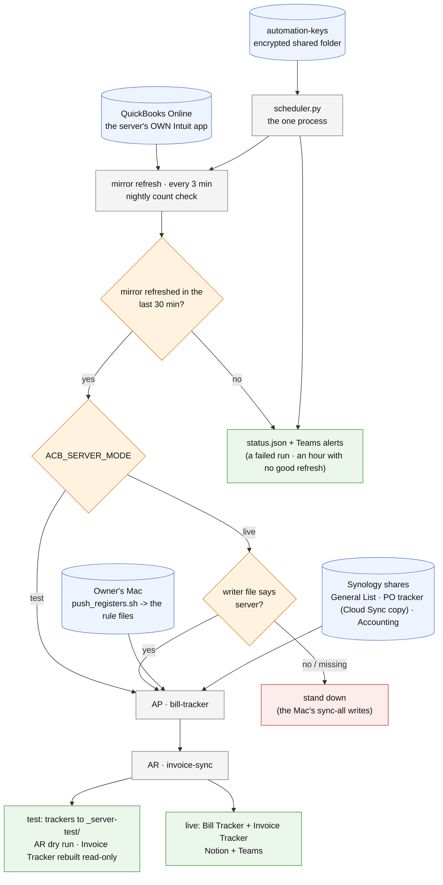

# docker/ - how the office server works

Last changed: 09/30/2026 - the README is plain setup instructions for the developer (no approval stops). Earlier
the same day: NEW, the office server package (replaced the retired invoice-sync-only container).

Update this chart - and the line above - in the same commit as any change to `docker/`
(`.github/flow_guard.sh` fails the push otherwise).

