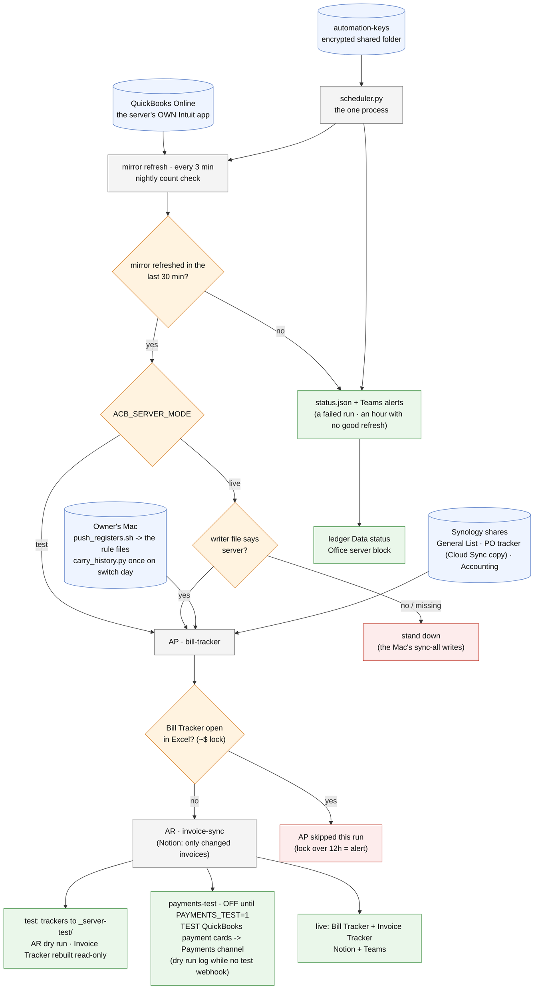

# docker/ - how the office server works

Last changed: 10/08/2026 - the AP step skips while the Bill Tracker is open in Excel (`~$` lock; a 12h-old lock alerts); NEW `carry_history.py` = the switch-day history carry Mac -> server; the ledger reads status.json. Earlier the same day: STATUS only: the Notion write-only-what-changed item is done (invoice-sync; flow unchanged). Earlier the same day: STATUS only: the server's Bill Tracker matches a Mac build cell for cell (flow unchanged). Earlier: 10/08/2026 - STATUS only (server updated to 6a417f0 from DSM). Earlier the same day: update_server.sh asks GitHub for its ed25519 host key only (DSM's ssh asked for ECDSA first, so the first real run failed the pin - safely, nothing changed). Earlier: 10/07/2026 - update_server.sh hardened after a security review: stays pasted in DSM (never run from the checkout as root), GitHub host key pinned, live = main only, refuses local edits / a second run, ownership handed back, commits logged; compose `stop_grace_period: 120s` so a restart lets the running step finish. Tested against a stand-in server (update, live-on-dev, local edit, GitHub unreachable). Earlier the same day: README 7b: first run pastes update_server.sh into the DSM task, later runs call it from the checkout. Earlier the same day: NEW `update_server.sh`: the owner updates the server from DSM Task Scheduler (pull, rebuild, restart, test-tracker permissions put back, log on the docker share) - no terminal, no developer. Earlier the same day: test mode: AR and the AR export read the server's OWN test Bill Tracker (they read the Mac's live one, so the AP -> AR hand-off was never tested). Earlier the same day: **payments-test is OFF** (`PAYMENTS_TEST=1` turns it on) until the base AP/AR run is proven on the server. When on, test mode adds it after AR: `invoice-sync/qbo_payment_notify.py --test` posts "TEST - QuickBooks payment received" cards to TEAMS_WEBHOOK_PAYMENTS_TEST (its own posted record), or logs what it would post while that key is blank - the team's Payments channel is proven here before go-live. Earlier: 10/06/2026 - the server's Bill Tracker is no longer locked to its own account (no chmod 600 in server mode); the Mac's sync-all stands down on AP + AR while writer.json says server. Earlier: 10/05/2026 - STATUS only (test week on the Synology; two open side notes). Earlier, 10/02/2026: the mirror reads MIRROR_KEY from secrets.env (qbo_vault fix). Same day: compose.yml builds as uid 1027 (the Synology's svc-automation user). Earlier, 10/01/2026: first build: the Dockerfile reuses GID 100 (Synology's users group); the server's QBO
login check needs only the four QBO keys. The flow itself is unchanged.

Update this chart - and the line above - in the same commit as any change to `docker/`
(`.github/flow_guard.sh` fails the push otherwise).

