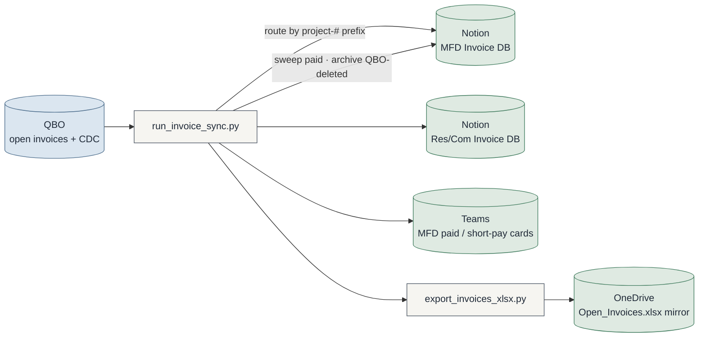
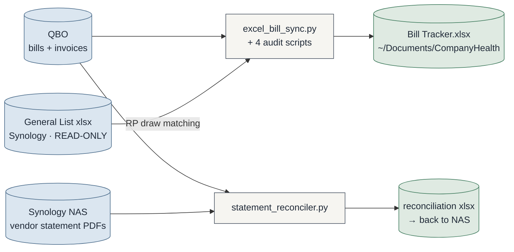
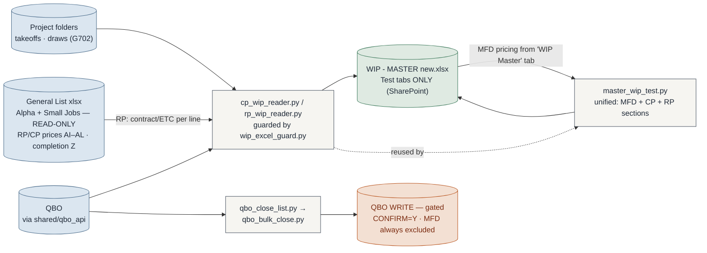
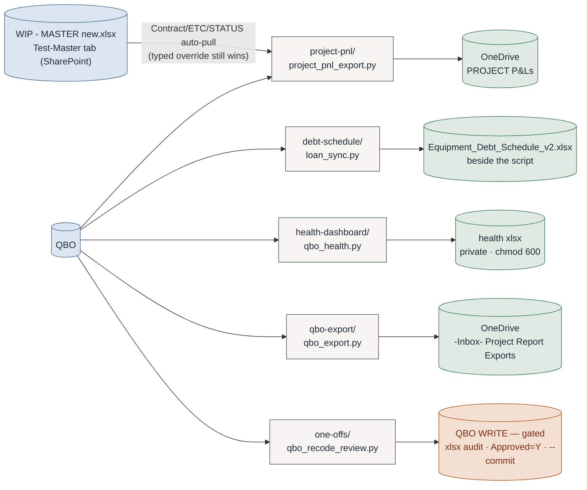
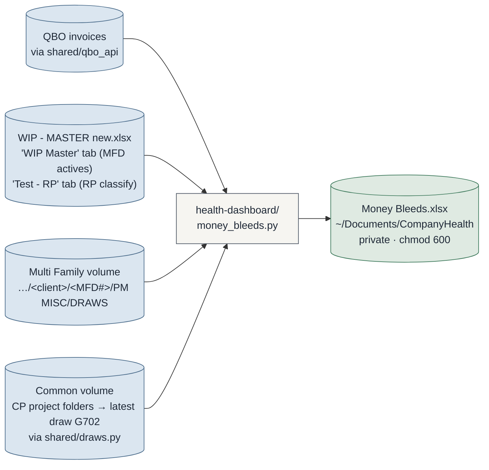

# Automation Suite — System Map

> **Maintenance rule (binding):** any commit that adds/removes a script, changes what a script
> reads or writes, or rewires a data flow MUST update this file in the same commit.
> Claude sessions: check this file whenever `git status` shows script changes at session end.
> GitHub renders the Mermaid blocks natively — view this file on github.com.
>
> **Presentation view:** [`architecture.html`](architecture.html) is the designed, full-system
> picture (open it in a browser after pulling). Refresh it when structure meaningfully changes;
> THIS file is the always-current source of truth.

Last updated: 2026-07-16 (project-pnl now auto-pulls Contract/ETC/STATUS from the WIP
master's Test-Master tab; new `shared/cost_lines.py` powers the Transactions sheet's
concrete → labor → materials grouping + per-(bill × account) combining)

---

## The folder map

```
shared/                the ONLY importable common code
├─ qbo_vault.py        QBO Keychain blob — one Touch ID unlocks all keys
├─ paths.py            per-machine output paths (machine.env at REPO ROOT)
├─ qbo_api.py          QBO auth + retrying GET, query_all, P&L walkers, PROJ_RE
├─ cost_lines.py       cost-line category (Concrete/Labor/Materials) + bill-line combine
└─ setup_qbo.py        vault admin CLI (--status/--test/--rotate/--purge)

invoice-sync/          QBO → Notion AR sync + Teams cards   (was automation-worker/)
bill-tracker/          AP bills → Excel tracker + 4 audit scripts
statement-reconciler/  vendor statement PDFs ↔ QBO open bills
wip/                   ALL WIP tooling: CP/RP readers + gated close scripts
project-pnl/           per-project P&L workbooks → OneDrive
debt-schedule/         equipment debt workbook + loan_sync (writes beside itself)
health-dashboard/      local company-health xlsx (private, chmod 600)
qbo-export/            one-row-per-line-item txn export → OneDrive inbox
one-offs/              occasional / not-yet-developed tools (never the repo root)
synology/              NAS file-tree audit (always --exclude the sensitive path)
docker/                invoice-sync container package (v1.1.0)
docs/                  this map + system references
```

**The rules (full text in CLAUDE.md):** one folder = one tool · `shared/` is the only
importable common code · tools never import tools · one-offs live in `one-offs/` ·
`machine.env` stays at the repo root.

**Auth in one line:** every QBO script goes through the shared Keychain vault (single
Touch ID per run); QBO is production-only; writers are gated (`--commit` / `CONFIRM=Y`) —
everything else is read-only against QBO.

---

## AR — the invoice sync (busiest pipeline)

`invoice-sync/` · manual `sync-ar` · Docker v1.1.0 on Synology (15-min loop)



Support cast (same folder): `doctor.py` diagnostics · `verify_invoices.py` /
`verify_excel_export.py` read-only audits · `sync_view.py` visual runner ·
`setup_keychain.py` Notion/Teams secrets.

---

## AP — bill tracker & statement reconciler

`bill-tracker/` · manual `sync-ap` &nbsp;|&nbsp; `statement-reconciler/`



---

## WIP — readers & close scripts (all in `wip/`)



Over/under-billing and job-borrow are computed columns in Excel, not in these scripts.
RP v2 (2026-07-13): the General List is the RP source — each RP job auto-splits into
`RP####` (slab) + `RP####-FTW` (flatwork) lines; CP jobs in the list stay standalone.
Number cells carry links (draw/takeoff/General List files; QBO customer page for Billed,
project P&L report for Costs — deep-link helpers in `shared/qbo_api.py`); rows whose
numbers don't reconcile render red (`needs_review`), including any QBO billed/costs
activity on a line with no contract in the list.

---

## Finance exports (read-only pulls → workbooks)



### Money Bleeds — company-health exceptions (2026-07-16)



Three exception checks, all read-only: **draws with no invoice** (MFD: latest numbered
draw folder vs latest QBO invoice date; CP: latest draw's G702 earned-less-retainage vs
cumulative QBO invoiced), the **Texas lien-notice clock** on every open invoice
(commercial 15th-of-3rd-month, residential 15th-of-2nd; work month defaults to invoice
month − 1 — conservative; retainage listed on its own statutory track), and **RP
wrap-up** (100% in the General List but not fully billed, read from the Test - RP tab).
CP draw discovery + G702 parsing moved to **`shared/draws.py`** (shared with
`wip/cp_wip_reader.py` — tools never import tools).

project-pnl reads the WIP master's **Test-Master** tab (the readers' unified MFD+CP+RP
table) to pre-fill Contract Price / ETC and honor a **Closed** status (WIP close-out:
% complete forced to 100%). Its Transactions sheet groups job costs
**concrete → labor → materials** via `shared/cost_lines.py` — non-labor bill lines
combine per (bill × account); labor lines are never combined.

---

## Who writes to QBO (the short list)

| Script | What it writes | Gate |
|---|---|---|
| `one-offs/qbo_recode_review.py --apply` | line Customer:Project + Class on job-cost lines | xlsx audit, `Approved=Y` rows only, then `--commit` |
| `wip/qbo_bulk_close.py` | closes customers/projects | `CONFIRM=Y`; always excludes MFD (manual close) |

Everything else is read-only against QBO. All other "writes" land in Excel, Notion, or Teams.

---

## Machine notes

- Output paths (OneDrive folders, `~/Documents/CompanyHealth/`) resolve through
  **`shared/paths.py`**: process env > `machine.env` (REPO ROOT, gitignored, per-machine) >
  owner's original defaults. New machines: `cp machine.env.example machine.env`, then
  **`python3 shared/paths.py`** — it prints where each path resolved from and flags anything
  missing or not writable. Never hardcode a machine path in a script.
- **Migration note (old clones):** after pulling the restructure, untracked files linger in the
  old `automation-worker/` folder. Move `.env` and `state/` into `invoice-sync/`, then delete
  the leftover folder. Until then, `invoice-sync/config.py` falls back to the legacy location
  automatically (the CDC watermark is never lost).
- Logs stay at `~/Library/Logs/Proficient/automation-worker/` (historical name kept on purpose)
  and always outside the repo. The Keychain service `proficient-automation-worker` also keeps
  its name — renaming it would orphan stored secrets.
- Each developer has their own Intuit app + own Keychain vault. One app connection = one machine.
