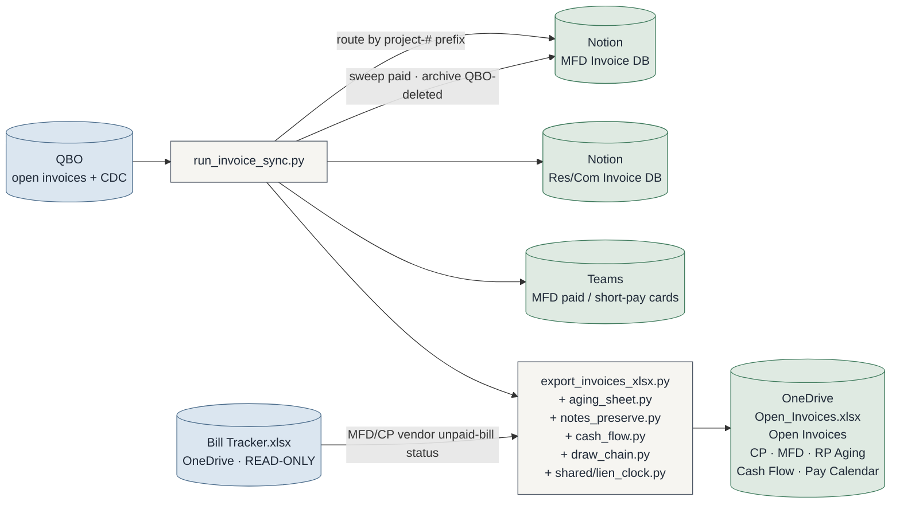
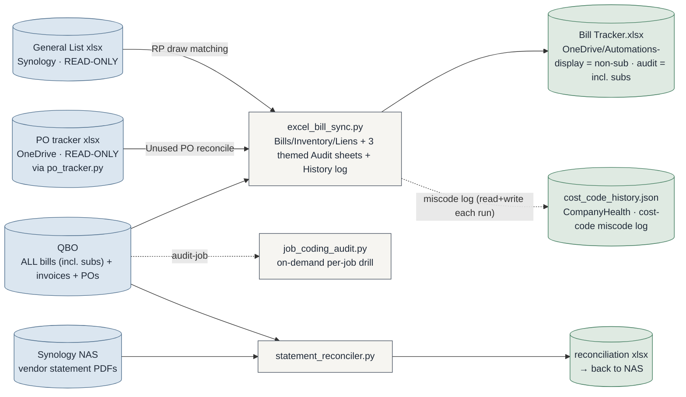
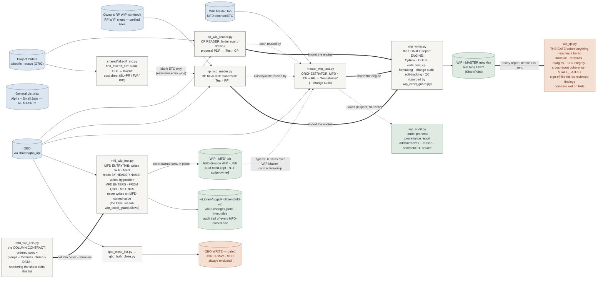
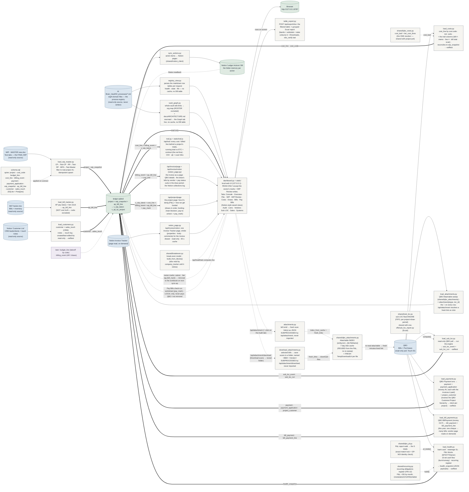
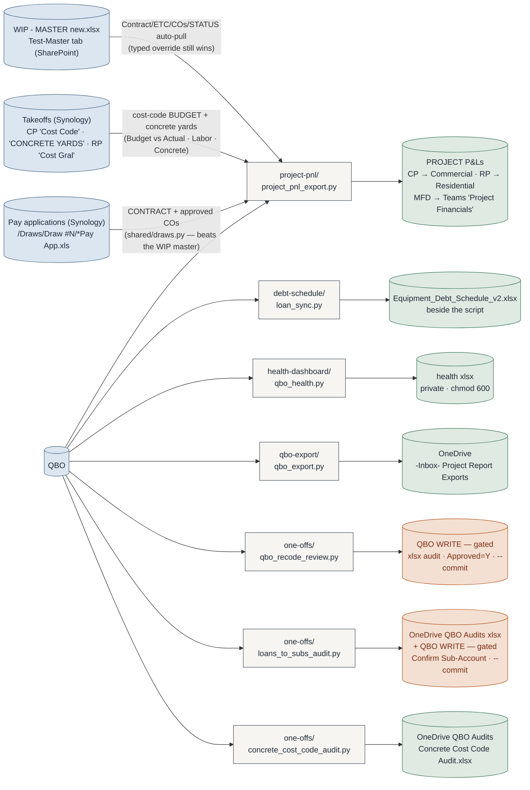
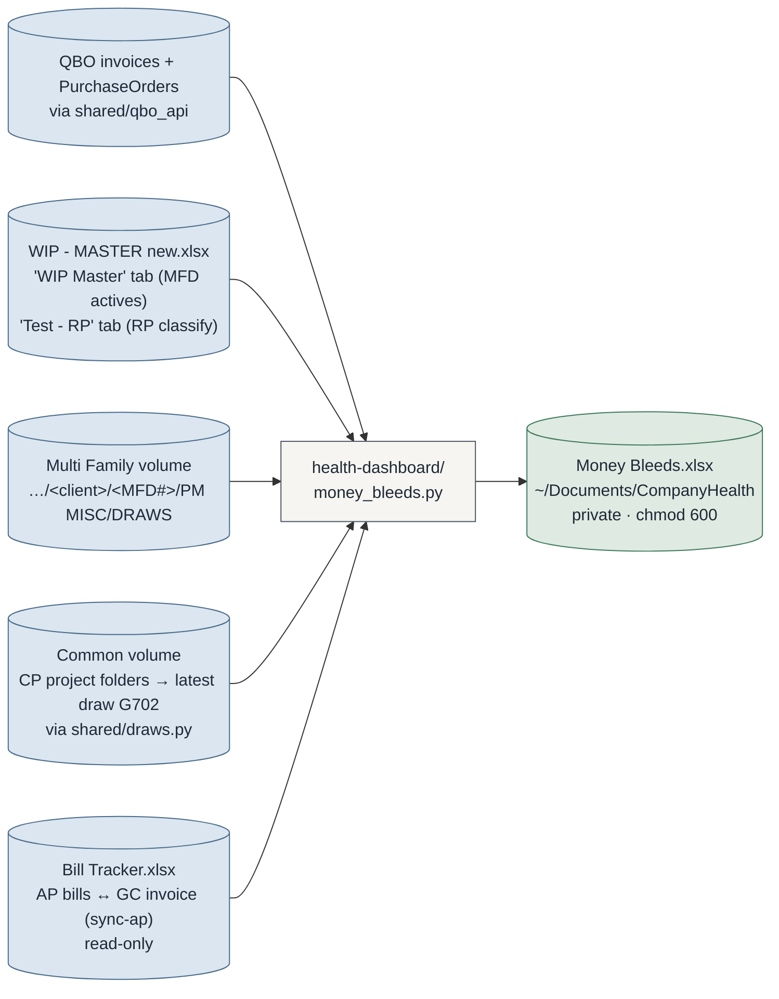

# Automation Suite — System Map

> **Maintenance rule (binding):** any commit that adds/removes a script, changes what a script
> reads or writes, or rewires a data flow MUST update this file in the same commit.
> Claude sessions: check this file whenever `git status` shows script changes at session end.
> GitHub renders the Mermaid blocks natively — view this file on github.com.
>
> **Presentation view:** [`architecture.html`](architecture.html) is the designed, full-system
> picture (open it in a browser after pulling). Refresh it when structure meaningfully changes;
> THIS file is the always-current source of truth.

Last updated: 2026-09-02 (ledger/: NEW **money trail** - `ledger/trail.py` + `static/trail.js`, `/api/trail`: every QBO line behind a project's Costs / Billed with the running total against ETC and contract; `cost_line` gained bill #, memo, line #, bill total, vendor/class ids, sub evidence, scan flag. 2026-08-25: NEW **Graph tab** — the org as a map (`ledger/vault_graph.py`,
`/api/graph`) AND NEW **WIP Review tab** — the WIP update as accept/merge. Each wip reader +
`master_wip_test` gained `--emit-review` (diff a Test tab, no write) and `--apply-review` (write
only approved values) modes backed by `wip/wip_review_common.py`; the ledger orchestrates them by
subprocess+JSON (`/api/wip/review`, `/api/wip/merge`) and shows every change WAS→NOW split into
Accept·QBO / PM answers. See the Graph tab and WIP Review entries in `ledger/STATUS.md`.)

Previously: 2026-08-19 (ledger/: NEW **Systems tab** — the systems & process registry
(`AI Brain_Vault/02_processes/*.md`) rendered LIVE in the dashboard. `ledger/registry_view.py`
parses the eight domain markdown tables per request (no cache, no DB table, no write-back);
`/api/processes` serves them; the tab filters by domain/owner/health/state/life. Vault path
resolves via `shared/paths.vault_dir()` (`ACB_VAULT_DIR`), READ-ONLY. This REPLACED the daily
06:38 markdown digest, which is disabled — the owner: "we just need to have this in the
Project Ledger, my systems and processes live view". Dashboard build v1.1.0.)

Previously: 2026-08-08 (ledger/ cont'd: shared/qbo_costs.py — cost_leaf MOVED out of project-pnl
(imported back, byte-compatible) so the ledger shares the ONE cost-code resolver; load_costs.py pulls
QBO Bills+Purchases → complete cost_line by cost code incl. subs, reconciles to wip_snapshot,
--selftest proves it offline. cost_line fleshed out + v_cost_by_project/v_cost_by_code views.
CLAUDE.md updated (cost_leaf location + ledger subsystem bullet). — earlier same day —
ledger/: new — the canonical project database. schema.sql defines the
6-table spine [project · cost_code · budget_line · cost_line · billing_event · wip_snapshot],
portable across SQLite and Postgres; load_wip_master.py lands the final WIP master Test tabs into
project + wip_snapshot, read-only on Excel, idempotent. load_bill_tracker.py adds an AP + lien feed
(ap_bill_line) from Bill Tracker.xlsx — deliberately NOT cost truth (subs excluded). dashboard.py +
static/ add a local read-only web UI (KPIs · Needs-attention · AP & liens · division rollup ·
projects · job detail · copy/CSV · Customize panel). Phase 1 of "own the spine, keep the systems as
peripherals." bill-tracker: FULL pull incl. subs → subs to the QBO Audit sheet, which gains an
FW-misplacement + sub-missing-project section and folds in the retired
duplicate/item-no-project/sub-bill audit scripts; cost codes captured audit-only. project-pnl:
"Open Project in QBO" header link → project home page on all three templates)

---

## The folder map

```
shared/                the ONLY importable common code
├─ qbo_vault.py        QBO Keychain blob — one Touch ID unlocks all keys
├─ paths.py            per-machine output paths (machine.env at REPO ROOT)
├─ qbo_api.py          QBO auth + retrying GET, query_all, P&L walkers, PROJ_RE
├─ qbo_costs.py        cost_leaf (the ONE cost-code resolver) + iter_cost_lines — shared w/ ledger
├─ qbo_attachments.py  Attachable index + fresh scan links (7-day cache reused from P&L) — ledger Audit 📎
├─ notion_client.py    thin Notion API client (create/query/update pages) — used by ledger/sync_actions
├─ cost_lines.py       cost-line category (Concrete/Labor/Materials) + bill-line combine
├─ draws.py            CP draw (AIA G702/G703) discovery + parsing (wip ↔ health)
├─ draw_moves.py       the PUSH: a bill carried into a later draw by agreement — <CompanyHealth>/draw_moves.json (project-pnl ↔ bill-tracker ↔ ledger)
├─ takeoff_etc.py      blank ETC → takeoff cost sheet (rp_wip_reader ↔ schedule preview)
├─ xlsx_verify.py      Excel-corruption gate: every xlsx writer calls assert_clean before handing over
├─ pnl_paths.py        resolve a project's P&L workbook + "last pulled" mtime (ledger ↔ project-pnl)
├─ lien_clock.py       Texas Ch. 53 notice deadlines (money_bleeds ↔ invoice-sync aging)
└─ setup_qbo.py        vault admin CLI (--status/--test/--rotate/--purge)

invoice-sync/          QBO → Notion AR sync + Teams cards   (was automation-worker/)
bill-tracker/          AP bills (FULL pull incl. subs) → Excel tracker + 3 themed Audit sheets (Coding · PO · Bills) + cost-code History log + job_coding_audit drill
statement-reconciler/  vendor statement PDFs ↔ QBO open bills
wip/                   ALL WIP tooling: wip_writer.py (shared engine) + CP/RP readers + close scripts
ledger/                canonical project DB: schema.sql spine + loaders (WIP · Bill Tracker · costs · AR invoices · customers) + dashboard
project-pnl/           per-project P&L workbooks → OneDrive
debt-schedule/         equipment debt workbook + loan_sync (writes beside itself)
health-dashboard/      local company-health xlsx (private, chmod 600)
qbo-export/            one-row-per-line-item txn export → OneDrive inbox
job-auditor/           DESIGN + prototypes: audits proposal scope vs takeoff cost
                       bands on the live job folders (read-only; proposes, never
                       applies) — see its SPEC.md / STATUS.md
one-offs/              occasional / not-yet-developed tools (never the repo root)
synology/              NAS file-tree audit (always --exclude the sensitive path)
docker/                invoice-sync container package (v1.1.0)
docs/                  this map + system references
```

**The rules (full text in CLAUDE.md):** one folder = one tool · `shared/` is the only
importable common code · tools never import tools · one-offs live in `one-offs/` ·
`machine.env` stays at the repo root.

**Auth in one line:** every QBO script goes through the shared Keychain vault (single
Touch ID per run); QBO is production-only; writers are gated (`--commit` / `CONFIRM=Y`) —
everything else is read-only against QBO.

---

## AR — the invoice sync (busiest pipeline)

`invoice-sync/` · manual `sync-ar` · Docker v1.1.0 on Synology (15-min loop)



Support cast (same folder): `doctor.py` diagnostics · `verify_invoices.py` /
`verify_excel_export.py` read-only audits · `sync_view.py` visual runner ·
`setup_keychain.py` Notion/Teams secrets.

**The aging tabs** (`aging_sheet.py`, added 2026-08-05; split per division
2026-08-10) are the owner's at-a-glance collections view: QBO-style Current /
1-30 / 31-60 / 61-90 / 90+ buckets aged by due date, **one tab per division
(`CP Aging` · `MFD Aging` · `RP Aging`, no Division column)**, invoices grouped
under the parent client and collapsed by default, the invoice number linked into
QBO, the collections clerk's Notion `Quick Status` note carried across, a
**`Lien` column** giving the Ch. 53 notice deadline, an **`Open Balance` → `Total
Amount`** pair where Open Balance is amber-flagged when it differs from the total
(a partly-paid invoice), a stepped slate client→project→invoice hierarchy sorted
alphabetically with a bottom TOTAL, and litigation invoices excluded. It **reads**
`Bill Tracker.xlsx` (the AP tool's output file, never its code — repo rule 3) for
what is still owed to vendors.

**QBO deep links are company-scoped** (`qbo_client.invoice_deep_link`, fixed
2026-08-11): Intuit's `/app/login?pagereq=invoice…&deeplinkcompanyid=<realm>`
form, not the bare `app/invoice?txnId=` — the bare link resolves the txnId inside
whatever Intuit company the browser session is on and opens a *different*
company's invoice. The realm comes from the loaded creds, never source/logs.
**The ledger dashboard uses the same company-scoped form** (2026-08-12): the
dashboard never touches QBO, so `load_costs.py` stashes the realm in a local
`meta` table (`qbo_realm`, never printed) after it authenticates; the dashboard
sends it in the payload and the front-end (`qboUrl` / `qboBillHref`) builds the
`/app/login?pagereq=…&deeplinkcompanyid=<realm>` links for both invoice and bill
deep links, falling back to the bare form until a sync has written the realm.

**Excel Notes are a two-way status channel** (`notes_preserve.py`, 2026-08-11).
The clerk writes collections Notes (legacy yellow sticky, author attached — **not**
threaded Comments, which openpyxl can't read) on the aging tabs: per-invoice on a
detail row, or per-client on a summary `N inv` cell (covers all that client's open
invoices; a per-invoice Note wins its own row). Two modes:
- **Preserve (default):** read Notes off the current file **before** overwriting
  and re-attach them verbatim. No Notion writes.
- **Absorb (default for `sync-ar`; `ABSORB_NOTES=0` disables):** the Note IS the
  status. Its text (stamped ` – Name, M/D`, en dash) replaces the Notes column, the
  cell Note is dropped, and it's pushed to Notion **`Quick Status`**; the prior
  status is archived (dated) to the page body, the documented **Collection Log**.
  The one place the sync writes a human-owned field: idempotent, and a Note absorbs
  only if its push succeeds (a failed push keeps the cell Note, never lost).
  `preview_export.py` runs absorb as a **dry-run** (logs the exact `Quick Status
  old -> new`, writes nothing) against a throwaway file.

**A note-driven cash-flow forecast** (`cash_flow.py`, 2026-08-12) reads those same
notes into two more tabs: **`Cash Flow`** (a weekly list of expected inflows with a
running cumulative, plus a "promised, needs a date" review section) and **`Pay
Calendar`** (a 6-week grid). `classify_note` keys on an inflow promise + a clear
date; conditional / stale / undated promises go to review, and chases, disputes and
"pay to <vendor>" outflows are excluded. Amounts are expected, not guaranteed.

**The MFD/CP draw-funding chain** is what those vendor columns actually answer.
The GC funds draw N → we pay draw N's vendor bills → those vendors issue
unconditional waivers → the GC releases draw N+1. So an unpaid draw is gated by
its **predecessor**, not by its own bills. `draw_chain.py` orders each project's
draws (excluding non-draw invoices like retainage releases, and keying by
contract so parallel contracts don't interleave), and the verdict separates
`PAY BILLS → unlock` — prev draw funded but our vendors still owed, ours to fix
— from `Waiting GC on prev`, where the hold-up is upstream. Projects running
parallel contracts report `Multi-contract` rather than a guess, because bills
carry a project #, not a contract.

> The chain sees only invoices that passed through Notion's open-invoice sync, so
> a paid `Draw #1` that was never synced is invisible. A later draw with no visible
> predecessor now reports **`Prev not synced`** (only a provable `Draw #1` is
> "First draw"), never a false "First draw" (fixed 2026-08-12). A QBO-assist that
> pulls a draw project's historical invoices to resolve the true predecessor is the
> planned next step, kept lean (only uncertain draw projects, never all invoices).

> **Run order: AP → AR.** That read is the only edge between the two pipelines,
> and it makes AR downstream of AP. `sync-all` runs **the bill tracker first,
> then the invoice sync** (~5 min total: AP ≈ 3.5 min, AR ≈ 1-2 min) — it was
> AR-then-AP until 2026-08-05, which would leave the vendor columns reporting
> the previous AP run. **This is a DAG, not a cycle:** the bill tracker pulls its
> bills *and* its invoices straight from QBO and never reads Notion or
> `Open_Invoices.xlsx`. AR never triggers AP; if the tracker is stale the tab
> subtitle turns red and the run logs a warning, and a missing file yields `?`
> rather than a false "Vendors Paid".
>
> **Step 3/3 - the ledger reload (owner 2026-08-24).** `sync-all` runs only the
> PRODUCERS (QBO → Bill Tracker.xlsx, QBO → Notion); the ledger the dashboard reads
> is loaded by a SEPARATE set of loaders, so a `sync-all` used to leave the dashboard
> on the last ledger snapshot (a paid invoice still showing open). `sync-all` now
> calls **`ledger/reload_ledger.sh`** as its final step - the loader half (WIP · bills
> · invoices `--no-qbo` · customers; costs stay on the dashboard Resync). So terminal
> `sync-all` and the dashboard's Resync run the same loaders and can't drift. (The
> `sync-all` wiring lives in the machine's `~/.zshrc`, not the repo; the script is
> repo-tracked.)

---

## AP — bill tracker & statement reconciler

`bill-tracker/` · manual `sync-ap` &nbsp;|&nbsp; `statement-reconciler/`



Full pull (2026-08-06): the tracker pulls every bill incl. subs. Subs are kept off the
Bills/Inventory/Liens sheets but flow to the audit — **THREE themed `Audit - …` sheets**
(the user 2026-08-25, de-bloat from 9 tabs via `build_audits`), each a filterable Excel Table
with an `Issue` column: **`Audit - Coding`** (Data Entry · Missing Project · FW Misplaced · Sub
No Project · Cost Code) · **`Audit - PO`** (Unused PO · Missing PO) · **`Audit - Bills`** (Not
Approved · Duplicates). The old `duplicate_bill_audit` / `item_no_project_audit` / `sub_bill_audit`
scripts were folded in and retired; `job_coding_audit.py` remains as the interactive `audit-job`
drill. Cost codes (QBO Item name) are captured for the audit only — never a display column.

**Cost Code (in `Audit - Coding`):** reuses **`shared/cost_code_audit.py`** (same logic as the
standalone `one-offs/concrete_cost_code_audit.py`). Captures each vendor's coding TYPE from its
`*1`-vs-`*2/3/4` split — concrete (→ all `*1`), material (never `*1`/`*5`/`*6`), both (yardage MEMO
must be `*1`), hauler (haul-off `*5` OK; override-only) — and flags lines that break the rule.
Credit-card / finance fees post to an expense account, not a cost code — never flagged. Overrides:
`<companyhealth>/concrete_suppliers.json`. Each flag's `Detail` carries the PO origin
(`bill_rows.build_po_index` codes + `cost_code_audit.po_origin`): PO-also-wrong = upstream (super/PM),
bill-deviated, or no-PO.

**Cost-code history (`Audit - History`, the user 2026-09-01):** the `Cost Code` findings feed a
persistent log — `cost_code_history.py` + `<companyhealth>/cost_code_history.json` (outside the
repo, never committed). Each real run opens/updates an entry per current miscode (First/Last Seen ·
Times), flips a vanished OPEN entry to **FIXED**, and re-opens a reappearing one — answering "how
often" and "what got fixed after refreshing." Key = `bill_id|cost_code`; caption = open/new/fixed +
a rolling new/run bill-clerk error rate. Dry-run never mutates the log.

**PO theme:** `po_tracker.py` reads the office PO tracker (`ACB_PO_TRACKER_XLSX`, READ-ONLY) and
`bill_rows.build_po_index()` pulls QBO `PurchaseOrder`. **Unused PO** = PO with no bill / stale;
**Missing PO** = a real COGS bill (not sub, not expense-only) with NO PO, last 90 days — the mirror.
Degrades to a QBO-only view if the tracker is unreadable.

---

## WIP — readers & close scripts (all in `wip/`)



**`mfd_wip_test.py` is deliberately NOT a `wip_writer` reader** (2026-08-25). The other
three tabs are generated reports rebuilt from scratch every run; `WIP - MFD` is MFD's own
DATA-ENTRY tab that they type into, and the script only adds columns to it. It therefore
keeps its Calibri look, **not** the frozen `WIP Master` Tahoma-8 style that rail 5a pins the
generated tabs to. It was built on a `Test - MFD` staging copy, audited attribute by
attribute against the live tab, then **merged into `WIP - MFD` and the staging tab deleted**
on the owner's instruction — which is why `'WIP - MFD'` is now the one live division tab in
`wip_excel_guard.ALLOWED_WRITE_SHEETS`. The contract that makes that safe: **columns B..M
are MFD's and the script never writes them**; it owns N..T and nothing else. QBO figures anchor on the
largest-contract row of each job group because a job like MFD192 carries three contract
rows in Excel but exactly one project in QBO, with no way to split costs between them;
sibling rows show a muted `see MFD192` marker, which `SUM()` ignores so the totals row
still counts each job once.

**Column order is DATA** (2026-08-26). `mfd_wip_cols.py` holds the ordered spec, the group
labels and every formula, exactly like `wip_writer.COLS`. The first cut hardcoded positions
and every added column became a shift plus a migration guard - three of four rebuild cycles
on 2026-08-25 were that, not changed requirements. Reordering the sheet is now editing a
list. The tab is read **by header name** and written **by position**, so old and new layouts
never have to agree, and a reorder cannot lose a typed value. There is deliberately **one `ETC`** meaning the whole contract's estimated cost, COs
included - not the `original + CO costs = revised` trio `wip_writer` and `project-pnl`
build (the owner, 2026-08-26). The tab's existing ETC came from `WIP Master`'s
`=(E/1.17)` fallback, computed off a contract that already carried ~91% of the job's
change orders, so a separate CO-cost column would have double-counted most of it.
Groups: `MFD ENTERS` (one
uninterrupted typing run) · `FROM QBO` (under the sync stamp) · `METRICS` (decisions, on the
right, incl. cost-to-cost earned revenue and billed-ahead/behind). Every change to an
MFD-owned value is appended to an immutable JSONL log under `~/Library/Logs/Proficient/`.

**Sheet chrome, kept for the record** (2026-08-25). While this lived on a staging tab, the
copy had to carry chrome openpyxl does not move with cells — tab colour, orientation,
fit-to-page, margins, zoom, print area. All of it is print behaviour, invisible on screen,
and it was the ONLY gap the replacement audit found. Writing in place now, the chrome is
already right and is left alone; only `widen_print_area()` remains, because the tab's own
print area stopped at column L and predated the new columns. The general lesson stands:
**a sheet copy that looks perfect on screen can still be broken on paper.** Superseded
detail: openpyxl carries none of it with a
cell-by-cell copy: tab colour, orientation, fit-to-page, margins, zoom and the print area.
All of it is print behaviour, so it is invisible on screen and only shows up when the report
is PDF'd for a bank. `copy_sheet_chrome()` runs from both `seed()` and `build_columns()`, so
an existing tab self-heals; it fills only what is unset, so it never fights a hand
adjustment. The print area is the one thing deliberately widened rather than copied — the
source's stops at column L, which predates the new columns.

**Retainage comes from the GL, not from invoice lines** (2026-08-25). QBO's `99 - Retainage`
invoice item posts to a real Other Current Asset account, `Retainage Receivable`, so the
per-job balance of that account is the answer and it is read from the `GeneralLedger`
report. Two traps are baked into the code as comments: the report's account filter is
**`account`, singular** (`accounts` is silently ignored and returns the whole truncated
general ledger), and `cp_wip_reader`'s gross-minus-net retainage heuristic must NOT be
reused here — on MFD's largest job it misses by more than twice the retainage actually at
stake, because retainage that has since been billed still sits in the invoice history. The column is expected to disagree with the tab's
own `Total Retainage`; the cell comment states the variance.

**The three readers import ONE engine (`wip_writer.py`), never each other** (2026-08-04).
`wip_writer` owns everything that turns `CpRow`s into a formatted, audited, edit-tracked
tab — `CpRow`, `COLS`, `write_test_cp`, the change audit, the QC check. The readers only
gather their division's numbers: `cp_wip_reader` (CP folder scan / draws / proposal PDF),
`rp_wip_reader` (the owner's RP file), and `master_wip_test` (MFD off the 'WIP Master' tab,
and orchestrates all three). This replaced the old shape where the engine lived inside
`cp_wip_reader` and every tool did `import cp_wip_reader` — a tool importing a tool, which
buried MFD/RP logic in a file named "cp" and let the layout drift.

Over/under-billing and job-borrow are computed columns in Excel, not in these scripts.
RP v2 (2026-07-13): the General List is the RP source — each RP job auto-splits into
`RP####` (slab) + `RP####-FTW` (flatwork) lines; CP jobs in the list stay standalone.
`master_wip_test --rp-from-file <xlsx>` (2026-07-29) replaces the GL pipeline for the
RP section with the owner's verified RP WIP workbook (sections from its band rows,
duplicates deduped, CP lines excluded); billed/costs still refresh from QBO per line.

**Pre-write audit (`--audit`, 2026-08-07).** `master_wip_test --audit` runs the full
pipeline (QBO, ETC fallback, classify) and writes `wip_audit.py`'s inspect-only workbook
(`~/Downloads/WIP Audit.xlsx` by default) instead of touching the WIP report — one row per
job with its Δ vs the current report (ADDED / REMOVED / SAME) + the reason, and CONTRACT /
ETC with the exact source (owner's RP-file cell, takeoff file+cell, or blank). It answers
"where did each non-QBO value come from, and why did this job appear/disappear" before any
write. READ-ONLY on every source (safe even with the WIP file open). Provenance is captured
at read time (`rp_wip_reader` tags each row's `audit_contract_src` / `audit_etc_src`).

**`shared/draws.py`** also carries the RETROACTIVE DRAW PERIOD helpers
(`learn_period_shape` / `infer_period_tag`, 2026-08-25): learn the draw-window shape from
the invoices that carry a `(Period:…)` tag and write the same tag onto the ones that don't,
so a job whose window straddles month end (MFD295 bills the 21st→20th) stops falling back
to the calendar month. The draw's month comes from the memo's own wording, not the invoice
date; retainage invoices stay untagged.

**`shared/job_lines.py`** — the ONE test for "does this expense line belong to this job".
STRICT by default (the line's `CustomerRef` is the project customer, exactly what every
caller did before). LEGACY mode adds two fallbacks for jobs that predate consistent project
coding: the line's own text names the job, or the BILL's memo names it AND names exactly one
job number AND the line text names none — with the guard that a memo naming 2+ jobs is
skipped, never split. Also `invoice_belongs`, since an older job invoices on the PARENT
customer. The CLASS rule is opt-in (`--job-class`) and refuses a bare division prefix. `--class-project` (the owner's "class/project lookup") turns the text/memo rules off so the answer is exactly class ∪ project - the right method for a job that ran across the class→project coding switchover. Shared by `project-pnl --legacy` and `one-offs/legacy_job_cost_pull.py` so the
P&L and the ad-hoc pull can never disagree about what a job cost.

**Blank ETC → takeoff fallback (2026-08-07).** When the estimator left an ETC cell
blank in the RP file, `rp_wip_reader.classify_from_file` calls
`shared/takeoff_etc.find_takeoff_etc` (moved out of `one-offs/rp_schedule_wip_preview`
the moment a second tool needed it — the verified SL+PR / FW / commercial-BID extractor)
to read the budget from the job's takeoff cost sheet. The estimator's manual entry always
wins — the fallback runs only on blanks. Provenance is colour-coded on 'Test - RP' (font):
**BLUE** = estimator's manual entry, **ORANGE** = machine-read from the takeoff (verify).
A job whose folder has no takeoff cost sheet stays blank and is flagged. Both this reader
and `master_wip_test` go through `classify_from_file`, so the fallback applies identically.
Test tabs are styled to match the real 'WIP Master' sheet — **frozen, see CLAUDE.md
rail 5a**: Tahoma 8, no-cents currency, and its two-line left-aligned title block
(company prefix read from `WIP Master`!B1 at runtime; no merge-and-center banner).
ONE commentary column (`NOTES` = owner's ACTION text · script notes · must-fix flags);
`TYPE` is Tract/Custom only. All tabs open Active-only. `qbo_links_only` is the DEFAULT for every tab (2026-07-29): NO
file/Synology links anywhere — the only hyperlinks are the QBO deep links on Billed
(customer page) and Costs (project P&L report), helpers in `shared/qbo_api.py`.
`--rp-from-file` also rewrites 'Test - RP' with the same RP rows in the master
layout (revised contract/ETC across the board) plus a CATEGORY column decided from
the DATA — GOOD only when QBO shows costs/billing, else NOT STARTED (still on the
schedule) or FTW BACKLOG — with a legend block, the
owner's ACTION notes in NOTES, and his colour marks (green verified / red changed /
orange verify) re-applied to the $ cells — marked Billed/Costs values survive the
QBO refresh. Rows whose numbers don't reconcile render red (`needs_review`).

---

## Ledger — the canonical project database (`ledger/`, Phase 1)



`shared/qbo_costs.py` is the same `cost_leaf` resolver **project-pnl** uses (moved there 2026-08-08
so a second tool could share it), so cost-code figures tie between the ledger and the P&L export.

**The idea:** own the spine, keep the systems as peripherals. QBO stays the books,
JobTread stays the ops shell, Excel goes back to being an export — but the reconciled
shape of a JOB lives in `ledger/`, in one place we own. `schema.sql` is the whole
6-table spine and is **portable across SQLite (the zero-install spike) and Postgres
(the real deploy) unchanged** — natural keys only, ISO-text timestamps, 0/1 booleans,
`ON CONFLICT` upserts.

**Phase 1 (done): `load_wip_master.py`** reads the FINAL WIP master (the Test tabs) and
lands `project` + `wip_snapshot` — no QBO generation, the sheet is the source. Each project
is read from its richest tab exactly once (CP←`Test - CP`, RP←`Test - RP`, MFD←`Test-Master`),
rows filtered to real project #s (`^(MFD|CP|RP)\d+(-FTW)?$`) so every legend/total/section row
drops out. Excel is opened **read-only**; upserts are idempotent by `project_no` /
`(project_no, report_date)`. `v_wip_latest` joins each project to its most-recent snapshot —
the portfolio rollup that's rebuilt in Excel today becomes one query.

**The dashboard (`dashboard.py` + `static/`)** is the browser UI over that query — a stdlib web
server (no Flask) that reads the ledger **read-only** and binds to `127.0.0.1` only. It serves
portfolio KPIs, a **Needs-attention** widget (generic exposure rules — underbilled / overbilled /
over-budget / borrowing-cash — that click-filter the table), the division rollup, and a searchable /
filterable / sortable projects table with click-into-job detail, click-to-copy cells, and CSV export. A **Customize** panel (theme, accent,
font, text size, density, width, widget + column visibility) is saved per person in `localStorage`.
Run it with `python3 ledger/dashboard.py` (the preview sandbox can't — it needs the DB + `shared/`
outside `.preview`). This is Rung 1 of turning the terminal DB into a platform; Postgres + a shared
server is Rung 2, when a second person needs to log in.

**The Bills tab** rolls the whole Bill Tracker (`ap_bill_line`, every bill - one row per bill,
`open_balance` per-bill so it sums cleanly) into the dashboard as an **Excel-dense table you scroll
like the workbook**. It opens with no configuration on the owner's daily view: **open bills, grouped
by Vendor A→Z, oldest bill first**, statuses right there as compact colored text. Above the table,
**quick-preset chips** (Open AP · GC-funded·unpaid·2mo+ [the pay-these-first / lien-risk list] · Lien
risk · To approve · Awaiting invoice · No project # · All bills) set a base predicate, and **every
field is its own filter dropdown** - Vendor · Division · Pay status · Invoice · Approved · Lien
(each populated from the data, AND-combined, with a Clear button). **Group by** (Vendor default ·
None · Division · Project · Draw) orders groups alphabetically with a per-group open subtotal, and
**Sort** (Oldest · Newest · Vendor · Most owed · Biggest · Lien) orders within them; group headers
carry a **collapse caret** and there is a **Collapse/Expand-all** button. Each row: a division-tinted
project chip, a company-scoped QBO bill link, an `MM/DD/YY` date, amount, open balance, and **four
separate status columns** - **Paid · Invoice · Lien · Appr** (one each, so a blank never hides a
missing value by being merged). **Clicking a row slides in a right-hand panel** with the bill (money
out) and its AR invoice / draw (money in) - real invoice pay status, amount, GC-still-owes, and
**QuickBooks deep links to both the bill and the invoice**; `_fetch_ap` joins each bill to
`billing_event` on Invoice # to attach `inv_qbo_id` / `inv_ar_status` / … for that panel. Money cells
feed the same select-and-sum bar as the rest of the app. Read-only over `ap_bill_line`; the Bill
Tracker file itself is still produced by `excel_bill_sync.py` (`sync-ap`).

**The Sub LOC tab** answers "how much have we FRONTED to subs before the client paid us, and how big
a line of credit do we truly need?" The proven model (`shared/sub_loc.py`: read-only QBO pull ->
per-project, per-draw-period, chronological FIFO netting of sub payments against client payments) is
loaded into the ledger by `load_sub_loc.py` (`sub_loc_event` timeline + `sub_loc_run` summary; Console
pipeline "Sub LOC"). The tab shows **outstanding** (today's float), **peak** (the LOC to size to), the
draw->repay lag, and a **repayment feed** (a client payment paid off these fronted subs). The SAME
engine backs the standalone `one-offs/sub_loc_report.py` Excel report - one model, two surfaces.

**The Health tab (2026-08-31)** folds the retired `health-dashboard/` Company Tracker / Company
Dashboard model into the ledger: **Money In / Money Out / Position / Break-Even** (the owner's
settled 2026-07-17 organization) plus the **Recurring & Debt** register (FIN-12). Sections are
assembled SERVER-SIDE (`_fetch_health` -> `GET /api/healthtab`, preformatted values) so the model
can never fork between a workbook and a page again. Most rows are **derived live** from tables the
other loaders already fill - AR + aging + the lien-past count from `billing_event` (the same
`shared/lien_clock` states as the Invoices tab), AP + the by-AR-state bill groups from
`ap_bill_line`, backlog / under-over / contract from `v_wip_latest`, draws-ready from the Draws
rollup, Sub LOC peak by division from `sub_loc_run`, top-customer concentration from YTD
`billing_event`. Only the QBO-only numbers ride `health_snapshot` via **`load_health.py`**
(Console pipeline "Health metrics (QBO)", in the `reload` chain): bank cash (stale-by-design -
QBO's feed only moves on uploads, so every cash figure carries the pull's as-of stamp, ruling
2026-07-28), retainage GL, the P&L blocks (via `shared/qbo_pl`), the 13-week cash flow ->
burn/runway, and `shared/recurring`'s register. Break-even is computed at page load by
`shared/breakeven.build_from_blocks` off the stored blocks, with the full **audit trail** table
(the user 2026-08-03: "I need to audit the numbers") and the DSO input taken from the ledger's
own client pay-speed. Every metric row click-jumps to the tab that holds its detail; bars reuse
the app's aging and division palettes (colour encodes, never decorates).

**Now also the CONTROL PLANE (2026-08-12).** Beyond reading, the dashboard runs the data pipelines
FROM the UI so the owner never touches a terminal. The **Console** tab is a **pipeline registry**
(`_pipelines()` / `_resolve_steps`): each pipeline = producer(s) + loader, run as **subprocesses**
(tools never IMPORT tools). The **Resync** (My view) runs the LOADERS ONLY (`reload` - read-only,
incremental 90-day cost pull); a Console **Run** also fires the real **producer** (`run_invoice_sync`
for AR -> Notion/Teams, `qbo_bill_tracker` for AP -> Excel; Touch ID). **WIP** loads the current draft;
generating a new **draft WIP** (the `wip/` readers -> Test tabs for PM review) is a separate,
confirm-gated action, never in a refresh. `POST /api/sync {pipeline}`, `GET /api/pipelines`,
`/api/sync/status` for the progress bar. Still one DB write surface (the waiver); the P&L is computed
live and the QBO deep links are company-scoped (see the invoice-sync note).

The **Liens** tab is a single filtered worklist: clickable stage tiles (Past-due / ≤7d / ≤15d / ≤30d /
Notice-sent / Lien-filed) filter one table keyed **CP # · Draw # · Name/Address · Invoice # · Amount**.
The job-detail panel links to **project-pnl**: `shared/pnl_paths.py` finds the project's
`Project_PnL_<proj>.xlsx` (+ its "last pulled" mtime); the dashboard can **open** it (`open`) or
**generate/refresh** it by shelling out to `project-pnl/run_pnl.sh` (a subprocess — tools never import
tools — gated behind a `confirm`; QBO stays read-only, only the .xlsx is written). This is the ledger's
first reach OUT to a peripheral tool; the "own the spine" inverse (project-pnl reading `cost_line` from
the ledger) is still ahead.

**Ledger Console → Project P&L** — the Console's `Project P&L workbooks` card runs
`project-pnl/project_pnl_export.py active cp|rp|mfd` as a subprocess, one division per
button. Declared under `actions` rather than `steps` so it is unreachable from the
`reload` / `all` chains (a Full refresh must never launch every project's P&L). Writes
Excel to OneDrive `PROJECT P&Ls` (CP → the job's Synology folder); the ledger DB is not
touched by it.

The **Systems** tab (2026-08-19) is the ledger's first window onto something that is not a job:
the **systems & process registry** (`AI Brain_Vault/02_processes/`, eight domain files). It is a
**live view, not a copy** - `registry_view.py` re-parses the markdown row tables on every
`/api/processes` request, so editing a vault file and hitting Reload is the entire update loop.
Nothing lands in `ledger.sqlite3`, nothing is written back: the vault stays the one owner of
registry truth, and the ledger only renders it. The three axes are kept visually distinct because
the registry keeps them distinct - a **health dot** (running / fragile / broken / nothing to fail
yet), a **state pill** (how sure the description is: confirmed · inferred · proposed), and, only
when a row is not live, a **life tag** (idea · agreed · building), which is what surfaces the
"agreed but never built" rows the registry exists to catch. Owners render as role handles, exactly
as stored; the roster is never read and no name enters the UI. The vault root resolves through
`shared/paths.vault_dir()` (`ACB_VAULT_DIR`), and a machine with no vault degrades to a one-line
message on that tab while the rest of the dashboard runs untouched.

**This replaced the 06:38 daily markdown digest**, which appended a written summary of the same
registry to `02_processes/digest-log.md` each morning. The scheduled job is disabled and the log
kept as history (the owner, 2026-08-19: "we just need to have this in the Project Ledger, my
systems and processes live view"). A view you open beats a digest you have to have received.

**On/off, on demand (owner: no always-on).** The dashboard is launched, not resident. `open_ledger.command`
starts it if down + opens the browser; **`ledger/app/`** is a real Cocoa app (`ledger_app.py`, PyObjC +
py2app) built by `build_ledger_app.command` → **Project Ledger.app**. Its Dock icon IS the on/off
indicator; it runs `dashboard.py` as a child and stops it on Quit / logout / shutdown / **real system
sleep** (`NSWorkspaceWillSleepNotification`), all via `pkill -f ledger/dashboard.py`. `dashboard.py`
gained `--background` (double-fork + setsid, so a launcher can't reap it) and clean SIGTERM shutdown.
The My-view freshness strip flags a source **⟳ Sync recommended** when it's stale > 48 **business**-hours
(`businessHoursSince` — weekends don't age the data).

**AP + liens (`load_bill_tracker.py` → `ap_bill_line`).** The line-level `Bills`/`Inventory`
sheets of `Bill Tracker.xlsx` load into `ap_bill_line` — vendor, project, account, open balance,
pay status, and the Texas lien clock per bill. This is **not** the cost ledger: Bill Tracker's
display sheets exclude subs, so it runs 25–98% short of the QBO WIP cost per job (measured). Job
cost stays in `wip_snapshot`; what this uniquely adds is AP pay status + lien deadlines, surfaced
as the dashboard's **AP & liens** widget (open-AP stats + a lien watchlist ordered by urgency) and
an AP line in each job's detail. Full-replace by `source` each run; `project_no` is a soft link
(no FK), so off-WIP/closed jobs are kept.

**Complete costs (`load_costs.py` → `cost_line`, built; awaiting the first live pull).** Pulls QBO
Bills + Purchases and writes one `cost_line` per expense line — attributed to a project by its line
`CustomerRef`, keyed to the cost code by `shared/qbo_costs.cost_leaf` (the SAME resolver project-pnl
uses, moved to `shared/` so the two can't drift). Subs are included, and it **reconciles** to
`wip_snapshot.costs_to_date` per project. `--selftest` proves the whole pipeline offline (no QBO);
a real load needs one Touch ID. Scoped full-replace by `source='qbo'` (idempotent, drops deleted
txns). This is what Bill Tracker couldn't be — the complete, cost-code-keyed cost ledger.

**AR invoices — the money IN (`load_invoices.py` → `billing_event`).** Systems connect, they don't each
re-pull QBO: `invoice-sync` already mirrors every QBO invoice into the **Invoice Tracker** Notion DBs
(Res/Com + MFD, paid kept 12 months), so the ledger reads THAT via `shared/notion_client` (the shared
token). Each invoice → one `billing_event`, keyed by the **Invoice #**, which is
the same number `ap_bill_line.invoice_no` carries, so the Draws view puts **billed-to-GC (in)** next to
**paid-to-vendors (out)** on every draw. `TotalAmt` = net billed; `Status`/`Balance` give Paid/Partially/
Unpaid. A **QBO gap-fallback** then fills ONLY the CP/MFD draws whose invoice was never entered in the
tracker — `fill_gaps_from_qbo` pulls just those by `DocNumber` (`source='qbo_fallback'`, ONE Touch ID;
skip with `--no-qbo`). Read-only on Notion + QBO; full-replace per source; `--selftest` proves it offline.
`dashboard.py::_fetch_draws` joins it by Invoice #; the **Draws tab is a table** — one row per draw
(Project # · memo · billed-in · invoice # · date · paid-out · stage), green when fully done, click a row
to open its bills. Each invoice also captures **due date + net terms + Notion's aging bucket**, and by
resolving its `Lien` relation against the Notion **Lien Tracker** (`load_lien_index`, one query → an
`{page_id: Status}` index; read-only and degrades to blank if the DB isn't shared with the integration)
it carries the matching **lien Status**. `dashboard.py::_fetch_open_invoices` then ages the open ones
(balance>0) by DUE DATE into Current/1-30/31-60/61-90/90+ - the SAME thresholds as
`invoice-sync/aging_sheet.py` - feeding the **Open Invoices tab**: an AR-aging grid (client-banded, the
open balance tinted green→red in its one bucket column, a per-bucket grand total), bucket-tile +
client / project / division / lien / litigation filters, and a QBO deep link on every Invoice #.
The **client shown is the parent GC**, resolved from the invoice's `Customer` relation via
**`shared/notion_customers.py`** (a `{page_id->title}` cache of the Res/Com + MFD customer lists);
`Customer (raw)` (the project-level child, "MFD177 - MERRITT PARK") is only a fallback, and the SAME
resolver names the client on the Excel so the two agree.
The relation→Status resolution lives in **`shared/lien_status.py`** (the ONE resolver: index the Lien
Tracker once, pick the most-escalated status per invoice), so it is shared - **invoice-sync's AR Aging
Excel carries the same "Lien status" column** beside its deadline clock, and the workbook and the site
can never disconnect (owner 2026-08-18). The clock (`shared/lien_clock.py`, a computed deadline) and the
status (the Notion Lien Tracker, what's actually been done) are different columns on purpose.
    QBO ──(invoice-sync)──▶ Invoice Tracker (Notion) ──┐
    Notion Lien Tracker ──(shared/lien_status)─────────┼─(load_invoices.py)──▶ ledger.billing_event ──▶ Draws · Open Invoices
                                                        └─(invoice-sync)──────▶ AR Aging Excel · "Lien status" column

**CRM / sales pipeline (`load_customers.py` → `customer` + `sales_touch`).** The pre-project spine:
the ledger owns the client/lead master too, not just the job. Reads the Notion "Customer List" data
source **read-only** and lands one `customer` row per page (identity + current pipeline stage +
Notion's own `Created by` / `Last edited by` system fields = who sourced it / who worked it last —
honest per-rep attribution with no manual Owner property to maintain) plus one `sales_touch` row per
"History of interactions" line in the page body (the outreach touch log, date parsed when present).
`v_sales_pipeline` (counts by stage) and `v_sales_by_rep` (activity by last editor) turn "what has the
outreach rep done" into a query instead of a scraped spreadsheet. Idempotent full-replace by
`source='notion_customer_list'`; `--selftest` proves the parse+load offline (no Notion). Auth reuses
the shared `NotionClient` token (the same one `sync_actions.py` uses). Not yet joined to `project` —
leads become jobs downstream — but it puts sales activity in the same database as the WIP.

**Still later:** `budget_line` (takeoff budget by cost code → budget-vs-actual from the spine) and
`billing_event` (AR / draws). Once both exist, over/under-billing computes from the spine, not Excel.
The dashboard **Sales tab** (built 2026-08-09) surfaces this read-only via `_fetch_sales` →
`v_sales_pipeline` / `v_sales_by_rep` / `sales_touch`: pipeline funnel, activity by rep (last-editor
attribution, the invoice-sync bot shown as "Automation (sync)"), warm-account cards with each
account's full touch log, and a searchable/filterable all-customers table linking out to Notion.

---

## Finance exports (read-only pulls → workbooks)



**`one-offs/schedule_report.py`** (read-only) — standalone weekly crew-schedule stage
Gantt. The model logic lives in **`shared/schedule.py`** (current-week discovery/parse,
address→pricing match, job×day×stage model, stage→colour) — shared with company_tracker,
which folds the same Gantt into the one workbook + dashboard. Pricing is broadened: the
**General List** resolves address→project# across all jobs (+ bid prices on the priced
sheets) and the **WIP master** overlays clean active contracts, with a project#→contract
cross-lookup and range/token-overlap fuzzy matching. Week anchors on today (next week's
pre-loaded schedule doesn't hijack it). Reads
`…/OPERATIONS/SCHEDULE/<yr>/<month>/Schedule M-D-YY.xlsx` for the latest Mon–Fri week →
one row per job, one column per day, each cell the STAGE that day (Pour / Wreck / Forms /
…) coloured by stage. Output `~/Documents/CompanyHealth/Weekly Schedule.xlsx` +
`Weekly Schedule.html` (chmod 600).

**`one-offs/money_out_register.py`** (read-only QBO) — check register for tracking
uncashed / outstanding checks. QBO exposes every check written (BillPayment Check +
Purchase Check: check #, payee, amount, bank) but NOT cleared status, so the register
carries a user-owned `CLEARED?` (Y/N) column and is STATEFUL — a refresh preserves your
marks (merged by txn id) and prunes long-cleared checks. Output `~/Documents/CompanyHealth/
Money Out Register.xlsx` (chmod 600); the aged-&gt;30-days unmarked checks are the chase
list, surfaced on the company dashboard.

**`one-offs/sales_rep_leads_report.py`** (read-only ledger) - one outreach rep's live book,
rendered for the estimators so nobody cold-calls an account that is mid-conversation. Reads
`customer` + `sales_touch` (the Notion Customer List feed, `ledger/load_customers.py`) and
attributes a rep's working set by Notion **"Last edited by"** - the settled convention, since
there is no manual Owner property. Cross-checks each account against `project.builder_or_gc`
and flags the ones that are ALREADY a live job's client. Output is a **PDF** written wherever
`--out` points - the suffix picks the format, and `.pdf` is rendered by the script itself
through headless Chrome, with the intermediate markup written to a temp dir that dies with the
run (the owner 2026-08-31: "html format is the wrong format for this" - every HTML here had a
PDF twin rendered from it seconds later, so the HTML was a build leftover, not a deliverable).
`.html` still works for debugging the markup. The rep is a runtime `--rep` argument so no name
is ever stored in the repo (`--list-reps` shows the options). **`--all`** swaps the rep filter for every account ANY rep has actually contacted
(Contacted · Follow up · Interested · No response - an untouched Lead is nobody's account yet,
a closed row is history) and adds a **Worked by** column: that is the collision list, and it is
what goes to the MFD president weekly (registry EST-13), since he bids commercial work
independently. **What's new since the last report** leads the page (the owner 2026-08-31 - the
director already has last week's list, so the useful part is what changed): the run drops a
snapshot of `{customer_key: last_contacted}` into `~/Library/Application Support/Proficient/
sales-report/` and the next run diffs against it, splitting the delta into **new accounts** (absent
from the last report entirely) and **fresh outreach** (already listed, last-contact date has since
moved). The report is written in place so there is no old file to diff - the snapshot IS the
history. Snapshots are scoped per rep, skip same-day files so a re-run still diffs against last
week, and prune to the last 12. With no prior snapshot it falls back to a 7-day window on
`last_contacted` and says so on the page; `--no-snapshot` runs without recording a baseline.
**`one-offs/sales_report_baseline_import.py`** seeds that history backwards from an
already-rendered report: it pulls the FULL LIST table out of a report PDF (`pdftotext -layout`),
maps the printed company names back to `customer` (normalized, prefix-tolerant for the clipped
column, and it refuses an ambiguous truncation rather than guessing - `Dooley Mack Constructors
of` matches two ledger rows), and writes it as that date's snapshot. Accounts absent from the
imported report are carried at their current date so another rep's book cannot masquerade as new.
It skips a PDF that is a different kind of report, and will not overwrite a RECORDED snapshot
without `--force` - real history outranks a reconstruction. This is how 2026-08-27 got a baseline
after the fact: the date-window guess said 12 accounts had fresh outreach, the true diff against
the list actually sent said **8** - the other 4 were already on it at the same contact date.
A scheduled task runs `load_customers` -> `--all --out ....pdf` every Monday and
**stops there** - it renders the report, the owner sends it himself (the owner 2026-08-31: "the
plan was never to send it automatically"). **`--email-body`** (allowlist-safe HTML for an Outlook
body) survives for manual use but has no caller. Deliverables live in
`~/Documents/CompanyHealth/Sales/`, never here.

**`one-offs/concrete_cost_code_audit.py`** (read-only QBO, the user 2026-08-25) - vendors code
to the wrong cost-code family. Cost-code NUMBER = the family (1 Concrete · 2/3/4 material ·
5/51/52 equip · 6 labor; `shared/qbo_costs`). The script CAPTURES each vendor's coding TYPE from
its `*1` vs `*2-4` split - **concrete** (ready-mix → all `*1`), **material** (rebar/lumber → never
`*1`/`*5`/`*6`, e.g. RCI), **both** (concrete + material, e.g. Preferred Materials → a yardage/
ready-mix MEMO line must be `*1`) - then flags every line that breaks its type's rule. Tunable
(`--threshold`/`--min-lines`) with an override JSON kept OUTSIDE the repo
(`<companyhealth>/concrete_suppliers.json`, `{concrete/material/both/exclude}`). Output
OneDrive `Works In Progress/QBO Audits/Concrete Cost Code Audit.xlsx` (Vendors · Miscoded Lines ·
Summary; plain, `assert_clean`).

**`project-pnl/completed_pnl.py`** (read-only, no QBO) — `<DIV> Overview.xlsx`: one row per
job with contract/ETC/billed/cost/GP over a sheet per job, all links internal so it survives
being emailed. Figures are read from each workbook's **Transactions** sheet (real numbers)
rather than its P&L sheet (live formulas openpyxl cannot evaluate), so the Overview can never
disagree with what it links to. **`project_pnl_export.py` rebuilds it at the end of every run**
(`--no-overview` opts out): it is assembled FROM the division's workbooks, so a run that
rewrites one leaves it describing figures that no longer exist, and reading workbooks costs
no QBO call. `shared/pnl_paths._archive_dirs()` is
the shared notion of "filed": `find_pnl` looks inside those folders and project-pnl
regenerates a filed job back into its archive folder — including the archive that
travelled with a division into a Teams channel (below).

**RETIRED 2026-09-03 — one job, one P&L.** A finished MFD job folder had grown THREE
workbooks of the same numbers: `Project_PnL_<job>.xlsx`, `<job> Job Result.xlsx`
(`completed_pnl.py`) and `<job> FINAL Closeout.xlsx` (`closeout.py`), plus `Closeout
Index.xlsx` and a never-once-run `completed_rollup.py` → `Completed MFD P&L.xlsx`. Five
outputs, one set of figures, all re-derived from the P&L. The owner called it: "why is there
a job result excel? shouldn't this be merged with the P&L? i feel that we are confused and
all over the place." The simplified finished-job report they name was already a FLAG on the
real P&L — `--simple` drops the draw sheets and coverage blocks — so the second file bought
nothing and drifted: MFD177/192/325 were carrying a "finished job" report on an ACTIVE job,
older than the P&L beside it. `closeout.py` and `completed_rollup.py` are deleted,
`completed_pnl.py` keeps only the Overview, and 26 stale workbooks were removed. What
remains: **`Project_PnL_<job>.xlsx` per job, `<DIV> Overview.xlsx` per division.**

**`shared/pnl_paths.division_dir` — the ONE routing rule, now Teams-aware (2026-09-03).**
A division's P&Ls land in its own folder because the owner shares that folder's link with
the PM who runs the division; the root would expose every PM's margins. `DIVISION_CHANNELS`
lets a division live in a **Teams channel** instead: **MFD → `Project Financials`**. A Teams
channel's Files tab is a SharePoint folder, so once the channel is synced it is an ordinary
local path — the same shape as `Company Files - WIP Report`, which the wip/ readers have
written to for months. No Graph API, no new key. Resolution order: an explicit `--out` ·
`ACB_PNL_DIR_<DIV>` · the synced channel · the OneDrive division folder. It is a **move**,
not a mirror — two copies of `MFD Overview.xlsx` would drift. When the channel is not synced
the run falls back to OneDrive and **says so in its note** rather than pretending it routed.

**`one-offs/job_vendor_report.py`** (read-only QBO) — job cost for a date window grouped
by vendor, in the shape a PM's "Transaction List by Vendor" takes but complete. `--compare`
reads the PM's own xlsx and adds a diff sheet labelling each gap: missing from their report,
not coded to the job in QBO, or a date-range difference. Uses `shared/job_lines.JobMatcher`
(class + project, aliases optional) and sums LINE amounts only.

**`one-offs/pnl_line_level_audit.py`** (read-only QBO) — the guard on the owner's standing
rule: **job cost comes from LINE amounts, never a bill's `TotalAmt`**. Sub bills are
multi-line and span jobs, so banking a whole bill because one line matched hands the job
every other job's money — silently, and plausibly. Re-derives every completed job's cost
from QBO at line level, compares it to what the delivered workbook reports (fails on any
disagreement), and prints the whole-bill figure alongside so the exposure is visible:
MFD228 is 879,732 line-level vs 1,516,919 by bill totals, +72%.

**`one-offs/legacy_job_cost_pull.py`** (read-only QBO) — costs + billing for an OLDER
job whose lines were never consistently project-coded. Plain "costs for this customer"
under-reports such a job, because only part of its cost carries the project customer.
Works on Bill + Purchase **LINE ITEMS** (never txn totals - most bills are multi-line
and only some lines belong to the job) and takes a line on the first rule that fires:
**1 project** (line `CustomerRef` = the project customer) → **2 line text** (line
Description or line `CustomerRef.name` names the job) → **3 bill note** (the BILL's
`PrivateNote` names the job, names exactly ONE job number, and the line's own text
names no job at all). **Guard on rule 3:** a memo listing more than one job number
(shared pump/material vendors) is SKIPPED, never split. Billing is separate: on an
older job the invoices usually sit on the **parent** customer, so both project and
parent are pulled and the invoices whose `PrivateNote` names the job are kept.
Customer ids resolve from the project # (`--project-id`/`--parent-id` override);
`--alias` adds the street name the job goes by. `--expect <json>` verifies a run
against known-good figures (✓/✗ per line) - fixtures live in the log dir, never in
this repo. The company-wide Bill/Purchase pulls are disk-cached under
`~/Library/Logs/Proficient/legacy-job-pull/` and shared across jobs.

**`one-offs/sub_loc_report.py`** (read-only) — subcontractor line-of-credit float
model. Sub bills (memo ~ "sub") paid → LOC draws (BillPayment date, allocated across
each bill's line projects); client Payments → repayments. Matched **by draw period**:
MFD/CP reimburse per `(project, month)` — the sub's work month (from the bill memo's
`Period …`) against the draw's month (from the invoice memo's `Draw #N (Period …)`),
so a May draw can't offset June sub costs; RP invoices are lump per scope → matched by
project. Chronological FIFO; a same-period GC draw arriving first is genuine prefunding.
Output `~/Documents/CompanyHealth/Sub LOC Report.xlsx` (chmod 600): Summary (company
peak = LOC truly needed + avg draw→repay float), **By Division** KPI (per-division peak /
float / outstanding), Ledger (each draw stamped with its reimbursing invoice + client-paid
date), Per-Project.

### Money Bleeds — company-health exceptions (2026-07-16)



> **Superseded by the ledger's Health tab (2026-08-31).** The Money In / Money Out /
> Position / Break-Even model now renders live in the ledger (`_fetch_health` +
> `load_health.py`), and the tracker outputs sat unopened since 2026-08-12. This stack
> stays runnable until the owner calls its retirement; nothing schedules it.

**`health-dashboard/company_tracker.py` + `company_dashboard.py`** (read-only, no QBO) —
the consolidation. `company_dashboard.py` holds the shared readers and `build_sections()`
— the ONE metric model (MONEY IN / MONEY OUT / POSITION) computed from the tracker
workbooks (Money Bleeds, Sub LOC, Money Out Register, health_dashboard, WIP master
Test-Master): AR/backlog/retainage/lien in; AP/POs/checks/LOC/burn out; cash/runway/
coverage/margins/over-under position. `company_tracker.py` folds that model into a single
**`Company Tracker.xlsx`** (Summary + Money In/Out/Position tabs + a **Weekly Schedule**
Gantt tab via `shared/schedule.py`, an **RP Billing Status** tab via `shared/rp_billing.py`, hero numbers, aging + LOC data bars, semantic colour)
AND renders `Company Dashboard.html` (with the Gantt section) from the same model, so the
workbook and page never disagree. The source Excels are the data layer; this is the
one-workbook-a-HTML-breaks-down deliverable.

Read-only exception checks: **draws with no invoice** (MFD: latest numbered draw folder
vs latest QBO invoice date; CP: latest draw's G702 earned-less-retainage vs cumulative
QBO invoiced), the **Texas lien-notice clock** on every open construction invoice
(commercial 15th-of-3rd-month, residential 15th-of-2nd; work month = invoice month;
OK rows hidden; retainage + equipment-lease/note invoices split off their own sheets),
**RP wrap-up** (slab lines 100% in the General List but not fully billed, from the
Test - RP tab), **unused POs** (open QBO purchase orders ≥30 days old with no bill
linked), and **open bills (AP)** (read from the Bill Tracker, never recomputed —
grouped by AR state × the sub's lien clock). CP draw discovery + G702 parsing live in
**`shared/draws.py`** (shared with `wip/cp_wip_reader.py` — tools never import tools).
The rich Excel (grouped bands, data bars, color scales, colored tabs) is a deliberate
exception to the plain-Excel rule — the user asked for an at-a-glance watchboard.

project-pnl reads the WIP master's **Test-Master** tab (the readers' unified MFD+CP+RP
table) to pre-fill **Original Contract / ETC + Approved COs** (original = total − COs;
revised rows are live formulas) and honor a **Closed** status (WIP close-out: % complete
forced to 100%). **Overhead is a % of the CONTRACT** - 10% company, 9% MFD view (the user
2026-09-03); a job with no contract on file lets total billed stand in (and costs to date
for the ETC), so a finished job's projection block is live, not zero. Per draw, the same
rule is sliced by the draw's income. Profit stays actuals (billed - cost - overhead). The
`<DIV> Overview` (`completed_pnl.py`) reads the contract out of each workbook and applies
the identical rule. Its Transactions sheet groups job costs
**concrete → labor → materials** via `shared/cost_lines.py` — non-labor bill lines
combine per (bill × account); labor lines are never combined. The **Budget vs Actual**
**Labor** and **Concrete** sheets (CP) are the PM/ops manager's main view (the user
2026-07-29): rows are that trade's cost codes (`*6` labor, `*1` concrete), columns are the
draw windows, and every code expands (outline ±) to the bills behind it with the amount in
the draw column it landed in — so a code row is visibly the sum of the rows beneath it.
Sales tax is billed on its own vendor line and is pulled OUT of the comparison (the takeoff
budget is pre-tax), then summed at the bottom with each contributing line; Concrete adds
yards and $/yd against the takeoff's implied rate, excluding lump vendor bills that carry
no yardage. CP **contract price and approved COs come from the latest G702 pay application**
(`shared/draws.py` `read_pay_app` — legacy .xls needs `xlrd`), overriding both the WIP
master and any hand-typed cell; the P&L names the source. The **Budget vs Actual**
sheet (CP + RP) joins the takeoff's cost-code budget (CP: the 'Cost Code(s)' sheet;
RP: 'Cost Gral', FW codes → the -FTW project) against QBO cost-code actuals — jobs
with change orders carry a "may be inaccurate" banner until the CO template ships its
cost line. Sheet order: P&L · Transactions · Budget vs Actual · Next Draw · draws ·
POs · Reconciliations · Cash Flow.

---

### JobTread migration tools (read-only unless noted)

**`one-offs/jobtread_migration_setup.py`** (read-only) — the "what do we still need to
add to JobTread" workbook. Two tabs: **Active Jobs to Add** (jobs on the daily schedule
with no JobTread job) and **Bidding to Add** (Notion **Bid List** RP rows whose
`Lead Status` is not terminal — not Sold / Lost / GC Not Awarded / No Response / No
Opportunity — and not already in JobTread). Reads the schedule, JobTread (full job
sweep), and Notion via the invoice-sync integration token (Keychain
`proficient-automation-worker/notion`). Output `~/Downloads/JobTread Migration Setup.xlsx`.
Overlaps `rp_jobtread_coverage.py` on the schedule half — coverage answers *does it have
an approved proposal*, this answers *does it exist at all* + the bid pipeline.

**`one-offs/jobtread_bloat_report.py`** (read-only QBO + JobTread) — open JobTread jobs
vs reality. Per open job, joins QBO (last invoice date, AR balance) + the daily schedule:
`CLOSE — paid & idle` (AR ≈ $0, idle > 90d, unscheduled), `CLOSE? — no QBO, stale`
(no invoices, created > 120d, unscheduled), `DONE? unpaid` (idle but money owed — an AR
chase, not bloat), `ACTIVE`/`NEW`. `-FTW` jobs fall back to the base project's QBO record
(flatwork often bills under the base #). Output
`~/Downloads/JobTread Bloat - Close Candidates.xlsx`.

**`one-offs/jobtread_close_jobs.py`** (**writes to JobTread**, audit-gated) — closes the
approved bloat. `--export` turns the bloat report into an APPROVE workbook with a
`CLOSE? (Y/N)` column (pre-filled Y only for the high-confidence bucket); the user edits it;
`--apply` dry-runs; `--apply --commit` performs it. **A job is closed by setting
`closedOn`** (its `status` is not directly settable) — verified reversible: clearing
`closedOn` restores the prior status, so `--reopen` is a true undo. Nothing is ever
deleted. MFD excluded by default. Every change logged before/after to
`~/Library/Logs/Proficient/jobtread_close_*.jsonl`.

**`one-offs/cable_calculator.py`** (read-only) — the PT-cable cut-list + cost engine
lifted out of the RP takeoff's hidden `'0'` sheet, mapped cell-for-cell and validated
against 64 active takeoffs (count, LF, every cut-list row and cost tie exactly). Inputs
live in **two** INFORMATION blocks (`I/K/M` 25-69 and `N/P/R` 24-69); cost rows are found
**by label** ("Cable take off" / "Per cable") because their row and rate vary per file.
The takeoff only sorts+sums typed pairs — it derives nothing — so this is a verification
harness for the JobTread migration, not an estimator tool.


**`one-offs/rp_wip_update.py`** (read-only sources, writes the OWNER'S file) — the RP WIP is
no longer a generated report; it is the owner's working file in OneDrive
(`RP WIP TO FIX_Final.xlsx`, sheet `RP WIP`). This OPENS that file and refreshes only the
machine columns (SCHEDULE ✓/✗, QBO billed/costs, GP%), appending schedule lines it doesn't
have. **The owner's colour marks are authoritative and are never overwritten** — theme 9
(orange) = ops manager must verify, `00B050` = verified, `FF0000` = he changed it. Dry run
by default; `--commit` writes back to OneDrive.

**`one-offs/jobtread_schedule_writer.py`** (**writes to JobTread**, audit-gated) — the daily
Excel schedule → JobTread dated tasks, using the estimator's own stage names (Wreck/Clean,
Set Forms, Trench, Grade/Backout, Drill Piers, Pour, Tension Cables). UPSERTs by (job, task
name): existing task → update dates only if changed; none → create. Never deletes, never
touches an unmapped task. Dry run by default.

**`one-offs/rp_wip_simple.py`** (read-only, writes the WIP master's `Test - RP` tab) — the
stripped-down RP WIP: contract · ETC · billed · costs · GP%, plus SCHEDULE / GENERAL LISTA
marks and an ACTION column. ETC is computed from the takeoff's **cost code rows**, never the
pier subtotal cell (that cell means slab+piers on some takeoffs and piers-only on others);
FW is never added to a non-FTW ETC. Sections: CP-on-RP-schedule, dropped-but-unbilled,
⚠ FTW-with-costs (not backlog), FTW backlog. **Writes no `file://` hyperlinks** — Excel
resolves those through ScopedBookmarkAgent at load and beachballs on a network share.

**Schedule file choice (all four tools):** `shared/schedule.schedule_on_or_before()` — never
reads a schedule dated in the future. The team pre-loads tomorrow's board, and a plain
"highest filename wins" pick silently jumps to it. `--as-of YYYY-MM-DD` overrides.

## Who writes to QBO (the short list)

| Script | What it writes | Gate |
|---|---|---|
| `one-offs/qbo_recode_review.py --apply` | line Customer:Project + Class on job-cost lines | xlsx audit, `Approved=Y` rows only, then `--commit` |
| `one-offs/loans_to_subs_audit.py --apply` | line `AccountRef` (parent `Loans to Sub-Contractors` → per-sub sub-account) on Bill/Purchase/VendorCredit | xlsx audit, `Confirm Sub-Account` filled, then `--commit`; skips stale-SyncToken / closed-period / not-still-on-parent |
| `wip/qbo_bulk_close.py` | closes customers/projects | `CONFIRM=Y`; always excludes MFD (manual close) |

Everything else is read-only against QBO. All other "writes" land in Excel, Notion, Teams,
or JobTread.

## Who writes to JobTread

| Script | What it writes | Gate |
|---|---|---|
| `one-offs/jobtread_close_jobs.py --apply` | a job's `closedOn` date (= closes it; clearing it reopens) | xlsx audit, `CLOSE?=Y` rows only, then `--commit`; excludes MFD; never deletes; `--reopen` undoes |
| `one-offs/jobtread_schedule_writer.py --commit` | task name + start/end date + task type on a job | dry run by default; upsert only, never deletes |

**What the JobTread API CANNOT do** (verified 2026-07-29/30, do not build on these):
`createDocument` (proposals/COs/invoices) is rejected outright — *"A job location name or
address is required"* even on jobs with a complete location. `updateCostItem(costCodeId)` on a
QBO-synced bill **returns success and changes nothing**. Bill UPDATES sync in neither
direction; the QBO push fires on **approval**, so corrections are free while `draft`/`pending`
and brutal once approved+paid. JobTread is the operational shell — QBO stays the cost truth.

The JobTread grant key (`JT_GRANT_KEY`, shared vault) has **write** access — grants carry
no read/write scope, they inherit the user's permissions. Verified 2026-07-27 by a
create → read-back → delete round-trip on the CP000 placeholder job.

---

## Machine notes

- Output paths (OneDrive folders, `~/Documents/CompanyHealth/`) resolve through
  **`shared/paths.py`**: process env > `machine.env` (REPO ROOT, gitignored, per-machine) >
  owner's original defaults. New machines: `cp machine.env.example machine.env`, then
  **`python3 shared/paths.py`** — it prints where each path resolved from and flags anything
  missing or not writable. Never hardcode a machine path in a script.
- **Migration note (old clones):** after pulling the restructure, untracked files linger in the
  old `automation-worker/` folder. Move `.env` and `state/` into `invoice-sync/`, then delete
  the leftover folder. Until then, `invoice-sync/config.py` falls back to the legacy location
  automatically (the CDC watermark is never lost).
- Logs stay at `~/Library/Logs/Proficient/automation-worker/` (historical name kept on purpose)
  and always outside the repo. The Keychain service `proficient-automation-worker` also keeps
  its name — renaming it would orphan stored secrets.
- Each developer has their own Intuit app + own Keychain vault. One app connection = one machine.
