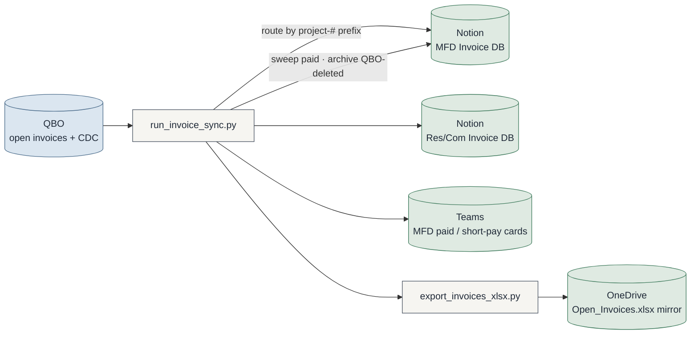
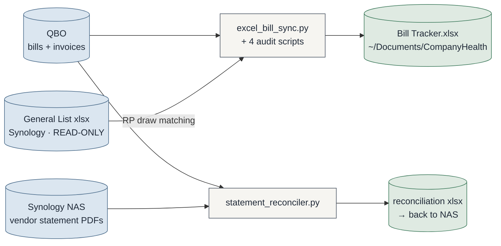
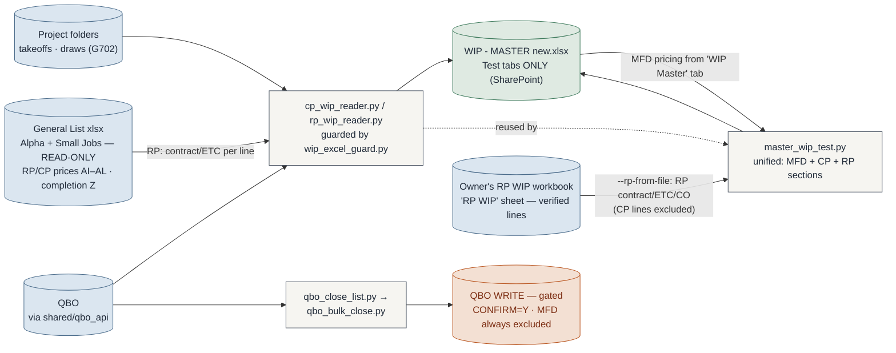
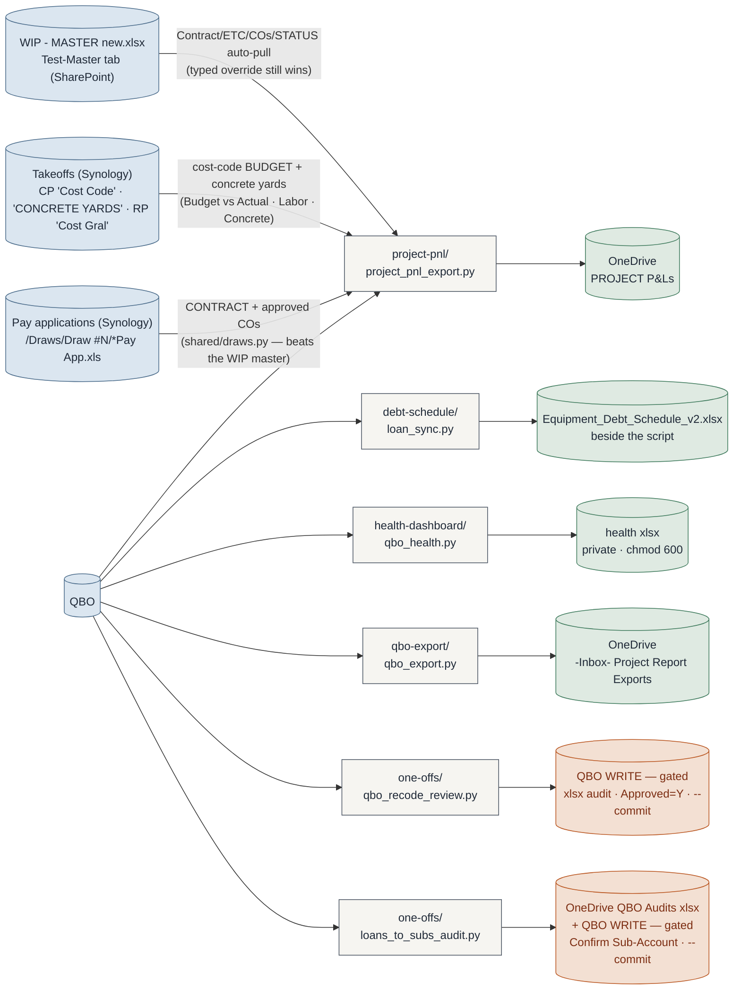
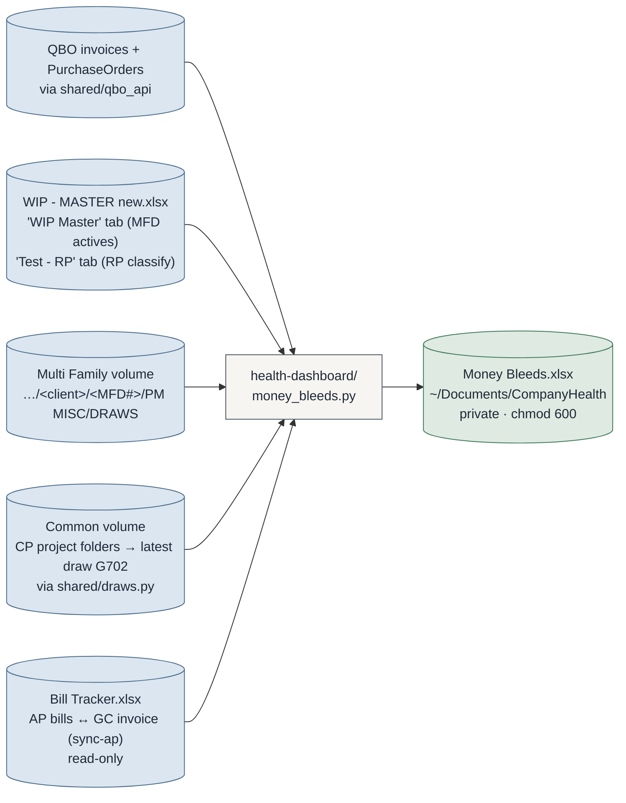

# Automation Suite — System Map

> **Maintenance rule (binding):** any commit that adds/removes a script, changes what a script
> reads or writes, or rewires a data flow MUST update this file in the same commit.
> Claude sessions: check this file whenever `git status` shows script changes at session end.
> GitHub renders the Mermaid blocks natively — view this file on github.com.
>
> **Presentation view:** [`architecture.html`](architecture.html) is the designed, full-system
> picture (open it in a browser after pulling). Refresh it when structure meaningfully changes;
> THIS file is the always-current source of truth.

Last updated: 2026-07-29 (project-pnl: CP contract price + approved COs now come from the
signed G702 pay application via `shared/draws.py`, not the draw invoices; new Labor and
Concrete budget-vs-actual-by-draw sheets with the bills nested under each cost code)

---

## The folder map

```
shared/                the ONLY importable common code
├─ qbo_vault.py        QBO Keychain blob — one Touch ID unlocks all keys
├─ paths.py            per-machine output paths (machine.env at REPO ROOT)
├─ qbo_api.py          QBO auth + retrying GET, query_all, P&L walkers, PROJ_RE
├─ cost_lines.py       cost-line category (Concrete/Labor/Materials) + bill-line combine
├─ draws.py            CP draw (AIA G702/G703) discovery + parsing (wip ↔ health)
└─ setup_qbo.py        vault admin CLI (--status/--test/--rotate/--purge)

invoice-sync/          QBO → Notion AR sync + Teams cards   (was automation-worker/)
bill-tracker/          AP bills → Excel tracker + 4 audit scripts
statement-reconciler/  vendor statement PDFs ↔ QBO open bills
wip/                   ALL WIP tooling: CP/RP readers + gated close scripts
project-pnl/           per-project P&L workbooks → OneDrive
debt-schedule/         equipment debt workbook + loan_sync (writes beside itself)
health-dashboard/      local company-health xlsx (private, chmod 600)
qbo-export/            one-row-per-line-item txn export → OneDrive inbox
one-offs/              occasional / not-yet-developed tools (never the repo root)
synology/              NAS file-tree audit (always --exclude the sensitive path)
docker/                invoice-sync container package (v1.1.0)
docs/                  this map + system references
```

**The rules (full text in CLAUDE.md):** one folder = one tool · `shared/` is the only
importable common code · tools never import tools · one-offs live in `one-offs/` ·
`machine.env` stays at the repo root.

**Auth in one line:** every QBO script goes through the shared Keychain vault (single
Touch ID per run); QBO is production-only; writers are gated (`--commit` / `CONFIRM=Y`) —
everything else is read-only against QBO.

---

## AR — the invoice sync (busiest pipeline)

`invoice-sync/` · manual `sync-ar` · Docker v1.1.0 on Synology (15-min loop)



Support cast (same folder): `doctor.py` diagnostics · `verify_invoices.py` /
`verify_excel_export.py` read-only audits · `sync_view.py` visual runner ·
`setup_keychain.py` Notion/Teams secrets.

---

## AP — bill tracker & statement reconciler

`bill-tracker/` · manual `sync-ap` &nbsp;|&nbsp; `statement-reconciler/`



---

## WIP — readers & close scripts (all in `wip/`)



Over/under-billing and job-borrow are computed columns in Excel, not in these scripts.
RP v2 (2026-07-13): the General List is the RP source — each RP job auto-splits into
`RP####` (slab) + `RP####-FTW` (flatwork) lines; CP jobs in the list stay standalone.
`master_wip_test --rp-from-file <xlsx>` (2026-07-29) replaces the GL pipeline for the
RP section with the owner's verified RP WIP workbook (sections from its band rows,
duplicates deduped, CP lines excluded); billed/costs still refresh from QBO per line.
Test tabs are styled to match the real 'WIP Master' sheet (Tahoma 8, no-cents
currency). The master tab is written `qbo_links_only`: NO file/Synology links — the
only hyperlinks are the QBO deep links on Billed (customer page) and Costs (project
P&L report), helpers in `shared/qbo_api.py`. Division tabs keep the full link set;
rows whose numbers don't reconcile render red (`needs_review`).

---

## Finance exports (read-only pulls → workbooks)



**`one-offs/schedule_report.py`** (read-only) — standalone weekly crew-schedule stage
Gantt. The model logic lives in **`shared/schedule.py`** (current-week discovery/parse,
address→pricing match, job×day×stage model, stage→colour) — shared with company_tracker,
which folds the same Gantt into the one workbook + dashboard. Pricing is broadened: the
**General List** resolves address→project# across all jobs (+ bid prices on the priced
sheets) and the **WIP master** overlays clean active contracts, with a project#→contract
cross-lookup and range/token-overlap fuzzy matching. Week anchors on today (next week's
pre-loaded schedule doesn't hijack it). Reads
`…/OPERATIONS/SCHEDULE/<yr>/<month>/Schedule M-D-YY.xlsx` for the latest Mon–Fri week →
one row per job, one column per day, each cell the STAGE that day (Pour / Wreck / Forms /
…) coloured by stage. Output `~/Documents/CompanyHealth/Weekly Schedule.xlsx` +
`Weekly Schedule.html` (chmod 600).

**`one-offs/money_out_register.py`** (read-only QBO) — check register for tracking
uncashed / outstanding checks. QBO exposes every check written (BillPayment Check +
Purchase Check: check #, payee, amount, bank) but NOT cleared status, so the register
carries a user-owned `CLEARED?` (Y/N) column and is STATEFUL — a refresh preserves your
marks (merged by txn id) and prunes long-cleared checks. Output `~/Documents/CompanyHealth/
Money Out Register.xlsx` (chmod 600); the aged-&gt;30-days unmarked checks are the chase
list, surfaced on the company dashboard.

**`one-offs/sub_loc_report.py`** (read-only) — subcontractor line-of-credit float
model. Sub bills (memo ~ "sub") paid → LOC draws (BillPayment date, allocated across
each bill's line projects); client Payments → repayments. Matched **by draw period**:
MFD/CP reimburse per `(project, month)` — the sub's work month (from the bill memo's
`Period …`) against the draw's month (from the invoice memo's `Draw #N (Period …)`),
so a May draw can't offset June sub costs; RP invoices are lump per scope → matched by
project. Chronological FIFO; a same-period GC draw arriving first is genuine prefunding.
Output `~/Documents/CompanyHealth/Sub LOC Report.xlsx` (chmod 600): Summary (company
peak = LOC truly needed + avg draw→repay float), **By Division** KPI (per-division peak /
float / outstanding), Ledger (each draw stamped with its reimbursing invoice + client-paid
date), Per-Project.

### Money Bleeds — company-health exceptions (2026-07-16)



**`health-dashboard/company_tracker.py` + `company_dashboard.py`** (read-only, no QBO) —
the consolidation. `company_dashboard.py` holds the shared readers and `build_sections()`
— the ONE metric model (MONEY IN / MONEY OUT / POSITION) computed from the tracker
workbooks (Money Bleeds, Sub LOC, Money Out Register, health_dashboard, WIP master
Test-Master): AR/backlog/retainage/lien in; AP/POs/checks/LOC/burn out; cash/runway/
coverage/margins/over-under position. `company_tracker.py` folds that model into a single
**`Company Tracker.xlsx`** (Summary + Money In/Out/Position tabs + a **Weekly Schedule**
Gantt tab via `shared/schedule.py`, an **RP Billing Status** tab via `shared/rp_billing.py`, hero numbers, aging + LOC data bars, semantic colour)
AND renders `Company Dashboard.html` (with the Gantt section) from the same model, so the
workbook and page never disagree. The source Excels are the data layer; this is the
one-workbook-a-HTML-breaks-down deliverable.

Read-only exception checks: **draws with no invoice** (MFD: latest numbered draw folder
vs latest QBO invoice date; CP: latest draw's G702 earned-less-retainage vs cumulative
QBO invoiced), the **Texas lien-notice clock** on every open construction invoice
(commercial 15th-of-3rd-month, residential 15th-of-2nd; work month = invoice month;
OK rows hidden; retainage + equipment-lease/note invoices split off their own sheets),
**RP wrap-up** (slab lines 100% in the General List but not fully billed, from the
Test - RP tab), **unused POs** (open QBO purchase orders ≥30 days old with no bill
linked), and **open bills (AP)** (read from the Bill Tracker, never recomputed —
grouped by AR state × the sub's lien clock). CP draw discovery + G702 parsing live in
**`shared/draws.py`** (shared with `wip/cp_wip_reader.py` — tools never import tools).
The rich Excel (grouped bands, data bars, color scales, colored tabs) is a deliberate
exception to the plain-Excel rule — the user asked for an at-a-glance watchboard.

project-pnl reads the WIP master's **Test-Master** tab (the readers' unified MFD+CP+RP
table) to pre-fill **Original Contract / ETC + Approved COs** (original = total − COs;
revised rows are live formulas) and honor a **Closed** status (WIP close-out: % complete
forced to 100%). Company overhead default is **10% of revenue** (MFD alt: 9% on costs —
also drives the MFD draw-coverage columns). Its Transactions sheet groups job costs
**concrete → labor → materials** via `shared/cost_lines.py` — non-labor bill lines
combine per (bill × account); labor lines are never combined. The **Budget vs Actual**
**Labor** and **Concrete** sheets (CP) are the PM/ops manager's main view (the user
2026-07-29): rows are that trade's cost codes (`*6` labor, `*1` concrete), columns are the
draw windows, and every code expands (outline ±) to the bills behind it with the amount in
the draw column it landed in — so a code row is visibly the sum of the rows beneath it.
Sales tax is billed on its own vendor line and is pulled OUT of the comparison (the takeoff
budget is pre-tax), then summed at the bottom with each contributing line; Concrete adds
yards and $/yd against the takeoff's implied rate, excluding lump vendor bills that carry
no yardage. CP **contract price and approved COs come from the latest G702 pay application**
(`shared/draws.py` `read_pay_app` — legacy .xls needs `xlrd`), overriding both the WIP
master and any hand-typed cell; the P&L names the source. The **Budget vs Actual**
sheet (CP + RP) joins the takeoff's cost-code budget (CP: the 'Cost Code(s)' sheet;
RP: 'Cost Gral', FW codes → the -FTW project) against QBO cost-code actuals — jobs
with change orders carry a "may be inaccurate" banner until the CO template ships its
cost line. Sheet order: P&L · Transactions · Budget vs Actual · Next Draw · draws ·
POs · Reconciliations · Cash Flow.

---

### JobTread migration tools (read-only unless noted)

**`one-offs/jobtread_migration_setup.py`** (read-only) — the "what do we still need to
add to JobTread" workbook. Two tabs: **Active Jobs to Add** (jobs on the daily schedule
with no JobTread job) and **Bidding to Add** (Notion **Bid List** RP rows whose
`Lead Status` is not terminal — not Sold / Lost / GC Not Awarded / No Response / No
Opportunity — and not already in JobTread). Reads the schedule, JobTread (full job
sweep), and Notion via the invoice-sync integration token (Keychain
`proficient-automation-worker/notion`). Output `~/Downloads/JobTread Migration Setup.xlsx`.
Overlaps `rp_jobtread_coverage.py` on the schedule half — coverage answers *does it have
an approved proposal*, this answers *does it exist at all* + the bid pipeline.

**`one-offs/jobtread_bloat_report.py`** (read-only QBO + JobTread) — open JobTread jobs
vs reality. Per open job, joins QBO (last invoice date, AR balance) + the daily schedule:
`CLOSE — paid & idle` (AR ≈ $0, idle > 90d, unscheduled), `CLOSE? — no QBO, stale`
(no invoices, created > 120d, unscheduled), `DONE? unpaid` (idle but money owed — an AR
chase, not bloat), `ACTIVE`/`NEW`. `-FTW` jobs fall back to the base project's QBO record
(flatwork often bills under the base #). Output
`~/Downloads/JobTread Bloat - Close Candidates.xlsx`.

**`one-offs/jobtread_close_jobs.py`** (**writes to JobTread**, audit-gated) — closes the
approved bloat. `--export` turns the bloat report into an APPROVE workbook with a
`CLOSE? (Y/N)` column (pre-filled Y only for the high-confidence bucket); the user edits it;
`--apply` dry-runs; `--apply --commit` performs it. **A job is closed by setting
`closedOn`** (its `status` is not directly settable) — verified reversible: clearing
`closedOn` restores the prior status, so `--reopen` is a true undo. Nothing is ever
deleted. MFD excluded by default. Every change logged before/after to
`~/Library/Logs/Proficient/jobtread_close_*.jsonl`.

**`one-offs/cable_calculator.py`** (read-only) — the PT-cable cut-list + cost engine
lifted out of the RP takeoff's hidden `'0'` sheet, mapped cell-for-cell and validated
against 64 active takeoffs (count, LF, every cut-list row and cost tie exactly). Inputs
live in **two** INFORMATION blocks (`I/K/M` 25-69 and `N/P/R` 24-69); cost rows are found
**by label** ("Cable take off" / "Per cable") because their row and rate vary per file.
The takeoff only sorts+sums typed pairs — it derives nothing — so this is a verification
harness for the JobTread migration, not an estimator tool.

## Who writes to QBO (the short list)

| Script | What it writes | Gate |
|---|---|---|
| `one-offs/qbo_recode_review.py --apply` | line Customer:Project + Class on job-cost lines | xlsx audit, `Approved=Y` rows only, then `--commit` |
| `one-offs/loans_to_subs_audit.py --apply` | line `AccountRef` (parent `Loans to Sub-Contractors` → per-sub sub-account) on Bill/Purchase/VendorCredit | xlsx audit, `Confirm Sub-Account` filled, then `--commit`; skips stale-SyncToken / closed-period / not-still-on-parent |
| `wip/qbo_bulk_close.py` | closes customers/projects | `CONFIRM=Y`; always excludes MFD (manual close) |

Everything else is read-only against QBO. All other "writes" land in Excel, Notion, Teams,
or JobTread.

## Who writes to JobTread

| Script | What it writes | Gate |
|---|---|---|
| `one-offs/jobtread_close_jobs.py --apply` | a job's `closedOn` date (= closes it; clearing it reopens) | xlsx audit, `CLOSE?=Y` rows only, then `--commit`; excludes MFD; never deletes; `--reopen` undoes |

The JobTread grant key (`JT_GRANT_KEY`, shared vault) has **write** access — grants carry
no read/write scope, they inherit the user's permissions. Verified 2026-07-27 by a
create → read-back → delete round-trip on the CP000 placeholder job.

---

## Machine notes

- Output paths (OneDrive folders, `~/Documents/CompanyHealth/`) resolve through
  **`shared/paths.py`**: process env > `machine.env` (REPO ROOT, gitignored, per-machine) >
  owner's original defaults. New machines: `cp machine.env.example machine.env`, then
  **`python3 shared/paths.py`** — it prints where each path resolved from and flags anything
  missing or not writable. Never hardcode a machine path in a script.
- **Migration note (old clones):** after pulling the restructure, untracked files linger in the
  old `automation-worker/` folder. Move `.env` and `state/` into `invoice-sync/`, then delete
  the leftover folder. Until then, `invoice-sync/config.py` falls back to the legacy location
  automatically (the CDC watermark is never lost).
- Logs stay at `~/Library/Logs/Proficient/automation-worker/` (historical name kept on purpose)
  and always outside the repo. The Keychain service `proficient-automation-worker` also keeps
  its name — renaming it would orphan stored secrets.
- Each developer has their own Intuit app + own Keychain vault. One app connection = one machine.
