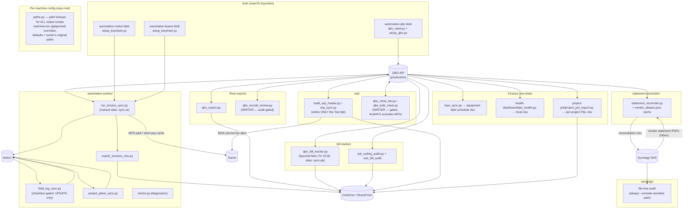
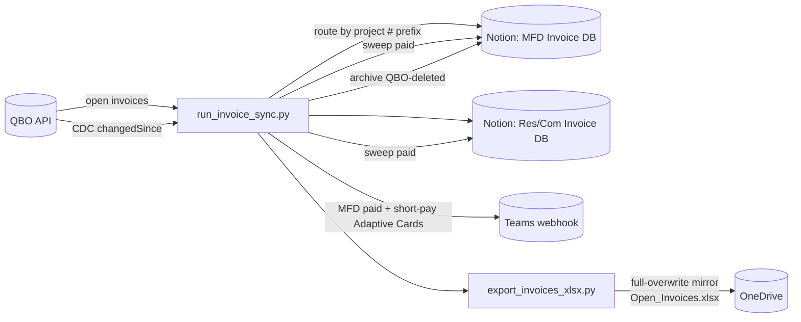

# Automation Suite — System Map

> **Maintenance rule (binding):** any commit that adds/removes a script, changes what a script
> reads or writes, or rewires a data flow MUST update this diagram in the same commit.
> Claude sessions: check this file whenever `git status` shows script changes at session end.
> GitHub renders the Mermaid blocks below natively — view this file on github.com to see the diagrams.

Last updated: 2026-07-09 (added paths.py per-machine config layer)

---

## Big picture

Every QBO script authenticates through one shared Keychain vault (single Touch ID per run).
QBO is production-only and the source of truth for costs/billed. Writers are gated
(`--commit` / `CONFIRM=Y`); everything else is read-only against QBO.

---

## Invoice sync detail (the busiest pipeline)

---

## Who writes to QBO (the short list)

| Script | What it writes | Gate |
|---|---|---|
| `qbo_recode_review.py --apply` | line Customer:Project + Class on job-cost lines | xlsx audit, `Approved=Y` rows only, then `--commit` |
| `wip/qbo_bulk_close.py` | closes customers/projects | `CONFIRM=Y`; always excludes MFD (manual close) |

Everything else is read-only against QBO. All other "writes" land in Excel, Notion, or Teams.

---

## Machine notes

- Output paths (OneDrive folders, `~/Documents/CompanyHealth/`) resolve through **`paths.py`**
  (repo root): process env > `machine.env` (gitignored, per-machine) > owner's original defaults.
  New machines copy `machine.env.example` → `machine.env` and point the two roots
  (`ACB_ONEDRIVE_BASE`, `ACB_COMPANYHEALTH_DIR`) at their own folders. Never hardcode a
  machine path in a script again — add a key through `paths.py` instead.
  Run **`python3 paths.py`** to confirm config on a new machine: it prints where each
  path resolved from and flags any target that is missing or not writable before you
  run a real script.
- Logs always go to `~/Library/Logs/` (external log dir per CLAUDE.md), never inside the repo.
- Each developer has their own Intuit app + own Keychain vault. One app connection = one machine.
