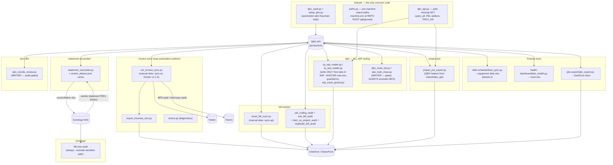
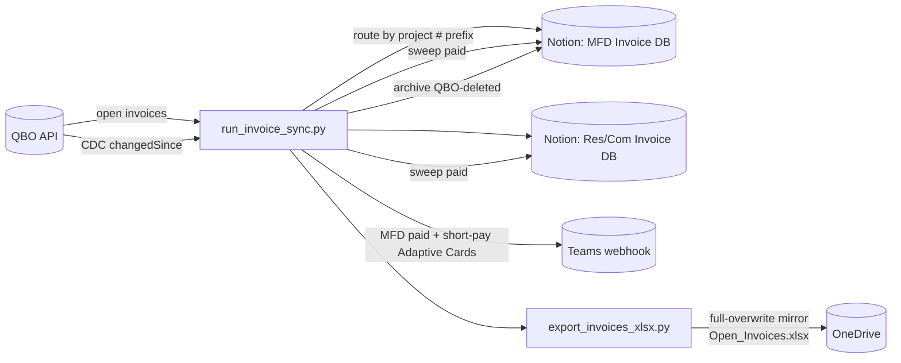

# Automation Suite — System Map

> **Maintenance rule (binding):** any commit that adds/removes a script, changes what a script
> reads or writes, or rewires a data flow MUST update this diagram in the same commit.
> Claude sessions: check this file whenever `git status` shows script changes at session end.
> GitHub renders the Mermaid blocks below natively — view this file on github.com to see the diagrams.

Last updated: 2026-07-13 (**the restructure**: `shared/` package created; `automation-worker/`
split into `invoice-sync/` + WIP readers joined `wip/`; Field Log subsystem erased; loose root
scripts rehomed to `debt-schedule/`, `qbo-export/`, `one-offs/`; Docker → v1.1.0)

---

## The structure rules (see CLAUDE.md for the full text)

**One folder = one tool. `shared/` is the only importable common code. Tools never import
tools. One-offs live in `one-offs/`, never the repo root. `machine.env` stays at the repo root.**

```
shared/          qbo_vault · paths · qbo_api · setup_qbo      ← the ONLY shared code
invoice-sync/    QBO → Notion AR sync (was automation-worker/)
bill-tracker/    AP bills → Excel tracker + 4 audits
statement-reconciler/  vendor statement PDF ↔ QBO bills
wip/             CP/RP WIP readers + gated close scripts      ← ALL WIP tooling
project-pnl/     per-project P&L workbooks
debt-schedule/   equipment debt workbook + loan_sync
health-dashboard/ local health xlsx
qbo-export/      transaction export
one-offs/        occasional tools (qbo_recode_review)
synology/        NAS file-tree audit
docker/          invoice-sync container (v1.1.0)
```

---

## Big picture

Every QBO script authenticates through the one shared Keychain vault (single Touch ID per run).
QBO is production-only and the source of truth for costs/billed. Writers are gated
(`--commit` / `CONFIRM=Y`); everything else is read-only against QBO.



**Removed 2026-07-13:** the Field Log subsystem (Bid List → RP/CP Field Logs / Project Plans
sync) — erased by decision, config fields dropped. The retired `wip_sync.py` stub and its
launchd plist are also gone.

---

## Invoice sync detail (the busiest pipeline)



---

## Who writes to QBO (the short list)

| Script | What it writes | Gate |
|---|---|---|
| `one-offs/qbo_recode_review.py --apply` | line Customer:Project + Class on job-cost lines | xlsx audit, `Approved=Y` rows only, then `--commit` |
| `wip/qbo_bulk_close.py` | closes customers/projects | `CONFIRM=Y`; always excludes MFD (manual close) |

Everything else is read-only against QBO. All other "writes" land in Excel, Notion, or Teams.

---

## Machine notes

- Output paths (OneDrive folders, `~/Documents/CompanyHealth/`) resolve through
  **`shared/paths.py`**: process env > `machine.env` (REPO ROOT, gitignored, per-machine) >
  owner's original defaults. New machines copy `machine.env.example` → `machine.env` and point
  the two roots (`ACB_ONEDRIVE_BASE`, `ACB_COMPANYHEALTH_DIR`) at their own folders. Never
  hardcode a machine path in a script — add a key through `shared/paths.py` instead.
  Run **`python3 shared/paths.py`** on a new machine: it prints where each path resolved from
  and flags any target that is missing or not writable before you run a real script.
- **Migration note (old clones):** after pulling the restructure, untracked files linger in the
  old `automation-worker/` folder. Move `.env` and `state/` into `invoice-sync/`, then delete
  the leftover folder. Until then, `invoice-sync/config.py` falls back to the legacy location
  automatically (the CDC watermark is never lost).
- Logs stay at `~/Library/Logs/Proficient/automation-worker/` (historical name kept on purpose)
  and always outside the repo. The Keychain service `proficient-automation-worker` also keeps
  its name — renaming it would orphan stored secrets.
- Each developer has their own Intuit app + own Keychain vault. One app connection = one machine.
