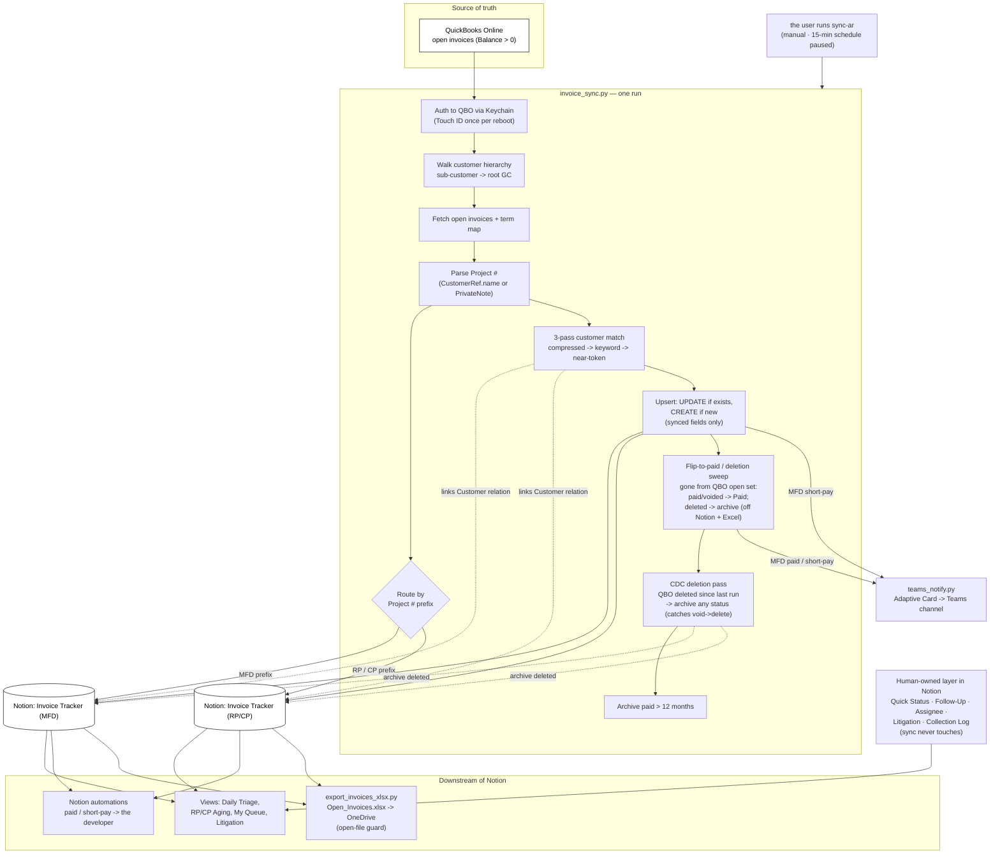

# Invoice Tracker — System Reference

> **2026-07-13 restructure:** the code folder was renamed `automation-worker/` → `invoice-sync/`
> (shared vault/paths now live in `shared/`). The log directory keeps its historical name
> (`~/Library/Logs/Proficient/automation-worker/`), as does the Keychain service
> (`proficient-automation-worker`). Paths below reflect the new layout.

System for tracking Proficient Concrete's open AR in Notion, mirrored from QuickBooks Online every 15 minutes. Replaces the prior Excel-based AR clerk workflow. Augments QBO data with collections-workflow layer (status, notes, follow-ups, ownership, litigation tracking).

---

## Purpose

QBO is the source of truth for invoice data (balance, dates, customer, terms). QBO is missing the **collections workflow layer**: who's chasing each invoice, what was said in the last call, when to follow up, whether the invoice is in dispute, etc. Excel previously held that layer but required manual maintenance.

Invoice Tracker keeps QBO data live and adds the workflow layer on top, in a single tool the team can collaborate on.

---

## Architecture

```
┌─────────────┐   manual: sync-ar       ┌─────────────────────┐
│ QuickBooks  │ ─── Python sync ───────→ │      Notion         │
│   Online    │   (15-min auto paused)   │  Invoice Tracker    │
└─────────────┘                          │  (RP/CP) + (MFD)    │
                                         └─────────────────────┘
                                                    │
                                                    ├─ Customer relations → Customer List / MFD Client List
                                                    ├─ Notion automations → the developer + team notifications
                                                    ├─ Teams Workflows webhook → MFD paid / short-pay cards
                                                    ├─ Excel sidecar → Open_Invoices.xlsx on OneDrive
                                                    └─ Daily Triage view → the developer's morning queue
```

**Direction:** QBO → Notion only. Notion is downstream; nothing writes back to QBO. Manual notes / ownership / status flips stay in Notion as the AR collaboration layer.

> **Run cadence (current):** the every-15-min launchd schedule is **paused** — a macOS update broke it and it hasn't been revived. The user now triggers each sync **manually** with the `sync-ar` shell alias. The permanent fix (self-host on Mac, moving the runtime out of `~/Documents`) is queued — see **Deployment status** and **Open items / to-dos** below. A full graph of the live flow is at the bottom of this doc.

---

## Components

### Notion databases

| DB | Data Source ID | Scope |
|---|---|---|
| Invoice Tracker (RP/CP) | `265b24f7-5585-803c-bcae-000ba27328cd` | Residential + Commercial invoices |
| Invoice Tracker (MFD) | `0f8e7cdf-16fe-4137-82e6-255e2ff400ce` | Multifamily invoices (isolated) |

Both live in the **Accounting teamspace**. MFD is split to maintain audience separation — Bill Tracker is split the same way.

### Customer relations

| DB | Data Source ID | Used by |
|---|---|---|
| Customer List | `19db24f7-5585-81af-a4e1-000bbe22e6cc` | Invoice Tracker (RP/CP) |
| MFD Client List | `34bb24f7-5585-80d3-94fa-000b847f04e2` | Invoice Tracker (MFD) |

Each invoice has a `Customer` relation populated by the sync. The sync resolves QBO's customer hierarchy (walks ParentRef chains) to find the top-level GC, then matches against the Notion customer list using a **three-pass matcher** (see below). Manual customer links in Notion are preserved when the sync can't auto-match.

#### Customer matcher — three ordered passes

`invoice_sync.py::_lookup_customer_id` runs three passes. Each runs **only** when the prior pass returns nothing, so safer matches never get overridden by fuzzier ones — by construction a later pass can only *add* a match, never change one already made.

| Pass | Method | Catches | Example |
|---|---|---|---|
| 1. Compressed-form exact | Strip all whitespace + punctuation, lowercase, compare equality | Spacing / punctuation drift | `LONE STAR GREEN HOMES` ↔ `LONESTAR GREEN HOMES` |
| 2. Keyword overlap (+ Jaccard tie-break) | Strip business suffixes (LLC/Inc), drop stopwords (homes, builders, construction…), tokenize, largest token intersection wins; `min_overlap = 1` distinctive keyword | Name reordering, suffix/word drift | `Ready Construction LLC` ↔ `Ready Const.` |
| 3. Near-token fallback | Retry overlap counting tokens as equal when one is a prefix of the other **or** `difflib` ratio ≥ 0.85; both tokens must be ≥ 5 chars | Plurals, possessives, single-char typos | `RICHMOND BUILDERS` ↔ `Richmonds Builders` |
| 4. All-stopword fallback | Fires ONLY when a name has **zero** distinctive keywords (entirely generic words). Matches it against other all-generic entries whose full word set is near-equal (every token has an exact/near counterpart, ≥2 tokens each side). Distinctively-named entries are excluded, so generic words never bleed onto them. | Names made entirely of ignore-list words | `Development & Construction Services LLC` ↔ `DEVELOPMENT & CONSTRUCTION SERVICE` |

> The matcher is **name-only** — it never uses the customer's Division. A client being both Residential and Commercial (Division multi-select) has no effect on matching.

On a full miss: the `Customer` relation stays empty, `Customer (raw)` text still populates, and the sync logs a red WARNING naming the unmatched customer and invoice. Add the customer to the right Notion list and the next sync auto-links it.

### Code (`invoice-sync/`)

| File | Purpose |
|---|---|
| `invoice_sync.py` | Main flow: fetch QBO, parse, route by Project # prefix, upsert to Notion, flip-to-paid sweep, archive old paid invoices |
| `qbo_client.py` | QBO REST API wrapper, auth via Keychain, customer hierarchy walk, term map |
| `notion_client.py` | Notion API wrapper with retry logic (429s, 5xxs), used by all sync flows |
| `run_invoice_sync.py` | CLI entrypoint with `--dry-run` flag |
| `run_invoice_sync.sh` | Bash wrapper invoked by launchd |
| `verify_invoices.py` | Audit script: pulls live QBO + Notion, compares invoice-by-invoice, generates markdown report |
| `export_invoices_xlsx.py` | Notion → Excel one-way mirror. Writes `Open_Invoices.xlsx` to OneDrive every sync. Read-only sidecar for the developer's ad-hoc summing + copy-paste-to-email workflow |
| `verify_excel_export.py` | Three-way audit (Excel ↔ Notion ↔ QBO). Confirms the OneDrive file is a true mirror of Notion open invoices and that Notion contains every routable QBO open invoice |
| `config.py` | Loads env vars + Keychain secrets, used by all worker scripts |

### Scheduling

**Current: manual.** the user runs each sync by hand with the `sync-ar` shell alias (mirrors `sync-ap` for the bill tracker). The alias calls `invoice-sync/run_invoice_sync.sh`.

The `~/Library/LaunchAgents/com.proficient.invoice-sync.plist` LaunchAgent (fires every 900 s / 15 min) **is no longer running** — a macOS update broke it and a prior attempt to repair it failed. The plist still exists in `invoice-sync/launchd/` and was repointed to the current log path on 2026-06-10 in case the schedule is revived. Until then, do not assume any automatic cadence — sync only happens when the user runs `sync-ar`. The permanent fix is in **Open items / to-dos**.

### Logs

Logs live **outside** the project folder (the project folder is AI-session-visible; logs are kept private):

```
~/Library/Logs/Proficient/automation-worker/invoice_sync.log
```

Written by `run_invoice_sync.sh` via `tee` — output is live in the terminal AND appended to the log. The logger uses colors for fast scanning: red WARNING (no-match), cyan fuzzy-match lines, green progress; a progress counter prints every 25 invoices.

### Credentials

| Service | Storage | How accessed |
|---|---|---|
| QBO OAuth (refresh token + client ID/secret + company ID) | macOS Keychain, biometric ACL, service `automation-qbo`, label `credentials` | `qbo_vault.py` (decrypts once per process, Touch ID required) |
| Notion integration token | macOS Keychain via `keyring` library, service `proficient-automation-worker`, key `notion` | `config._get_notion_secret()` |

Neither token is ever in code, env files, or logs.

---

## Sync run sequence

Each 15-min fire executes:

1. Auth to QBO (refresh OAuth token, ~1 sec)
2. Load QBO customer hierarchy → `{customer_id → root_parent_name}` map (~5 sec, ~2900 customers)
3. Load QBO term map → `{term_id → term_name}` (Net 30, Net 45, etc.)
4. Query open invoices from QBO (`Balance > 0`) → ~150-170 rows
5. Load Notion customer caches (Customer List + MFD Client List)
6. Load Notion invoice page caches → `{Invoice ID → page_id}` for both DBs
7. For each open QBO invoice:
   - Parse: extract Project # via regex from CustomerRef.name OR PrivateNote (memo fallback for legacy invoices)
   - Route: MFD prefix → MFD DB. RP/CP prefix → Res/Com DB.
   - Resolve parent customer via hierarchy walk
   - Match to Notion customer list (three-pass matcher: compressed-form → keyword overlap → near-token)
   - Upsert: UPDATE if Invoice ID exists in cache, CREATE if not
   - Write synced fields ONLY (never touches human-owned fields)
8. Flip-to-paid / deletion sweep: query Notion-side invoices with `Status != Paid`. For any whose Invoice ID isn't in the QBO open set:
   - **Has a QBO Payment** → flip Status=Paid, Open balance=0, stamp Paid Date.
   - **No Payment, but still exists in QBO** (voided / zero-balance / written-off) → flip to Paid (closed, stays on file).
   - **No Payment AND QBO confirms it's deleted** (read-back via `qbo_client.invoice_exists` returns empty) → **archive the Notion page** (soft-delete → Trash, 30-day restore) so it disappears from Notion views and the Excel mirror. Only a positive "gone" answer archives; a lookup error leaves the row untouched for the next run.
9. CDC deletion pass: ask QBO Change Data Capture what invoices were **deleted** since the last clean run (one call), confirm each is actually gone (`invoice_exists`), and archive the matching Notion page from the invoice cache **regardless of status**. This catches deletions the open-set sweep can't — invoices already marked Paid when deleted (void→delete). The changedSince watermark is stored in `state/invoice_cdc_state.json` and advanced only on a clean pass (QBO caps the lookback at 30 days).
9. 12-month archive: query Notion invoices where `Status = Paid AND Date < (today - 12 months)`. Archive (soft-delete, recoverable for 30 days).
10. **Excel export:** pull Status≠Paid rows from both Notion trackers → write `Open_Invoices.xlsx` to OneDrive (full overwrite). See "Excel mirror" section below for behavior.
11. Log summary; exit cleanly or with partial-failure code.

---

## Field reference

### Sync-managed (written by code on every run, never edit in Notion)

`Invoice #` · `Invoice ID` · `Project #` · `Customer (raw)` · `Date` · `Due Date` · `Total Amount` · `Open balance` · `Status` (Unpaid/Partially Paid/Paid) · `Aging Bucket` (Current/1-30/31-60/61-90/90+) · `Memo` (QBO PrivateNote) · `Net Terms` (Net 15/30/45/60/90/Due on Receipt/COD) · `Last Synced` · `QBO Link` · `Division` (RP/CP DB only)

### Half-managed (sync writes when matched, preserves manual edits when unmatched)

`Customer` (relation) · `Paid Date` (set once at flip moment, never overwritten)

### Human-owned (sync never touches)

`Quick Status` · `Next Follow-Up` · `Assignee` · `Project Manager` · `Last Action Date` · `Litigation` (checkbox) · `Lien` (relation) · Page body / Collection Log

---

## Notion-side conventions

### Views

| View | Filter | Purpose |
|---|---|---|
| RP Aging / CP Aging | Division-scoped, Status≠Paid, group by Aging Bucket | Division-specific daily collections |
| Daily Triage | Status≠Paid, Litigation≠true, Next Follow-Up≤today, group by Assignee | the developer's command view — see ALL pending items grouped by who owns them |
| My Queue | `Assignee = Me`, due today | Personal daily queue (each user sees only their assigned items) |
| Paid | Status=Paid, group by Paid Date (relative) | Recent payment history |
| Litigation | Litigation=checked, group by Customer | Disputed AR workflow |

### Automations

- **Sync stale check** (planned): notify the developer if any Last Synced > 1 hour ago
- **Paid notification**: when CP or MFD invoice flips to Paid → notify the developer
- **Short-pay notification**: when CP or MFD invoice flips to Partially Paid → notify the developer
- **Teams MFD payment events**: sync script POSTs paid + short-pay events to a Teams channel via a Microsoft Power Automate Workflows webhook. Independent from the Notion automation above — both fire. Configured by `TEAMS_WEBHOOK_MFD_PAID` env var; leave empty to disable. Phase 1 scope: MFD only. See "Teams notifications" section below.
- **Follow-up date arrived**: notify Assignee at the moment of date (limited, see automation docs)

### Teams notifications (MFD payment events)

The sync script directly POSTs JSON to a Microsoft Teams Workflows webhook when:

- An MFD invoice flips to **Paid** (handled by the flip-to-paid sweep)
- An MFD invoice's Status transitions **Unpaid → Partially Paid** with a balance decrease (handled in the per-invoice upsert — fires only on the transition, not on subsequent partial payments)

Notion's parallel "Paid notification" automation still fires too — the Teams post is additive, not a replacement. CP and RP invoices are out of Teams scope in Phase 1.

**Setup (one-time):**

1. In the target Teams channel: click `⋯` next to the channel name → **Workflows**.
2. Pick the template **"Post to a channel when a webhook request is received"** → **Next**.
3. Confirm the team and channel → **Add workflow**.
4. Copy the generated `https://prod-xx.westus.logic.azure.com:443/workflows/...` URL.
5. Paste into `invoice-sync/.env` (Mac) or `docker/.env.docker` (Synology):

```
TEAMS_WEBHOOK_MFD_PAID=https://prod-xx.westus.logic.azure.com:443/workflows/...
```

The URL is tied to one specific channel and can't be guessed, but treat it like a low-grade secret (don't commit, fine in `.env`). To rotate or revoke, delete the workflow in Teams and create a new one.

**Payload shape:**

The script POSTs a full **Adaptive Card** wrapped as `{type: "message", attachments: [{contentType: "application/vnd.microsoft.card.adaptive", content: {…}}]}`. The Workflow template's "Post card" action consumes this directly with no template editing. Green accent for paid, orange/yellow for short-pay; info only (no "Open in QuickBooks" button, per the user). An earlier flat `{title, text, …}` JSON version was accepted with a 2xx but rendered nothing — that's why `teams_notify.py` sends the full card structure. Exact schema is in `invoice-sync/teams_notify.py::notify_invoice_event()`; fire a safe test with `test_teams_webhook.py` after any URL rotation.

**No duplicate fires:** the flip sweep excludes already-paid invoices, and the short-pay path requires `prior_status == Unpaid`, so consecutive partial payments don't re-notify — only the first Unpaid → Partially Paid transition.

**Billed line items on the card:** the card includes a "Billed" section listing the invoice's **positive** line items (the draw description, "Retainage Billed", etc.) each with a `+$` amount. Negative lines (prior-billing offsets, retainage held back) and subtotal lines are excluded by design (`_positive_line_items` in `invoice_sync.py`, re-filtered in `teams_notify.py`). For short-pay the lines come from the live QBO invoice; for paid they're fetched from QBO by Id (`qbo_client.fetch_invoice`).

**Failure handling:**

Teams webhook calls are best-effort. Network failures, 4xx/5xx responses, and timeouts are logged at WARNING and swallowed — the sync run still completes and Notion still updates. Notion is the source of truth; if a Teams message gets lost, the invoice's new Status is still visible in Notion.

### Collection Log convention (page body)

```
[date] · [name] · [method: call/email/text] · [what happened] → [next step]

2026-05-04 · the developer · email · sent reminder + waiver request → no response
2026-05-09 · the developer · escalated to John (PM) · Liz needs builder approval → John following up
2026-05-12 · John · phone · Confirmed waiver coming Monday → next follow-up 5/16
```

Enforced by convention, not by Notion. Audit trail lives long-term.

---

## Excel mirror (`Open_Invoices.xlsx` on OneDrive)

After each sync, `export_invoices_xlsx.py` pulls open invoices from both Notion trackers and writes a fresh Excel file to:

```
~/Library/CloudStorage/OneDrive-ProficientConcrete,LLC/Collections/Open_Invoices.xlsx
```

OneDrive picks up the change and syncs to cloud automatically (the worker does not touch OneDrive credentials — it only writes a file).

### Design — one-way, full overwrite

| Behavior | Detail |
|---|---|
| Direction | Notion → Excel only. Never reads, only writes. |
| Merge logic | **None.** Every sync builds a brand-new workbook and saves over the existing file. Whatever Notion shows at sync time IS the file. |
| Paid invoices | **Excluded by filter.** Only `Status in [Unpaid, Partially Paid]` rows are exported. When an invoice flips to Paid, it disappears from the next file. |
| Clerk-side sorts/filters | Wiped each sync. The auto-filter dropdown stays (it's set by the export on row 1), so re-sorting is one click. Persistent sort state does NOT survive. |
| Clerk-side cell edits (notes, color, etc.) | Wiped each sync. **Excel is read-only by design.** All edit-worthy data (Quick Status, Follow-Up Date, Assignee, Litigation) lives in Notion. |
| The developer's manual copy (`Open_Invoices copy.xlsx`) | Untouched by the script. Safe place to scribble, but goes stale immediately. |

If the developer needs a stable working file, he should keep his notes in **Notion** (Quick Status / Collection Log) — not the Excel.

### Columns (left-to-right)

Division · Project # · Client · Date · Invoice # · Net Terms · Due Date · Past Due · Memo · Total Amount · Open Balance · Status · Aging Bucket

PM, Quick Status, and QBO Link live only in Notion. **Past Due** is a signed day count — positive = days overdue, negative = days until due, `0` = due today (e.g. `+12` / `-2` / `0`). Past Due > 30 days is bold red.

### Configuration

`invoice-sync/.env`:

```
INVOICE_EXPORT_PATH=~/Library/CloudStorage/OneDrive-ProficientConcrete,LLC/Collections/Open_Invoices.xlsx
```

Change the path here to repoint (Synology, Desktop, etc.) — no code change required.

### "Excel is open" guard

Before writing, the export checks for Excel's lock file (`~$Open_Invoices.xlsx`) in the same folder. Excel auto-creates that hidden file whenever anyone has the workbook open (the developer, the user, anyone) and OneDrive syncs it across machines.

- **Lock present** → skip the Excel write, log a loud WARNING with re-run instructions. The QBO→Notion sync still completes. Close the file and re-run `sync-ar` to refresh the Excel mirror.
- **No lock** → write normally.

Why this matters: without the guard, an open Excel session lets Excel's AutoSave silently overwrite the script's update with the stale in-memory buffer, losing the sync. The guard prevents that collision.

If Excel crashed and left a stale `~$Open_Invoices.xlsx` behind, delete it manually from the OneDrive Collections folder — sync will then resume normally.

### Failure mode

If the Excel export errors (OneDrive folder missing, disk full, etc.), `run_invoice_sync.py` catches the exception and logs it without failing the parent sync. The QBO→Notion sync already succeeded by that point — the Excel is a sidecar, not a dependency.

---

## Maintenance

### Run a sync (current, manual)

```bash
sync-ar          # the shell alias — runs run_invoice_sync.sh
```

Add `--dry-run` to preview without writing to Notion.

### Watch a run live

```bash
sync-ar; tail -f "$HOME/Library/Logs/Proficient/automation-worker/invoice_sync.log"
```

### Visual run (progress bar + phases)

`sync_view.py` is a dependency-free front-end that runs the sync and re-renders its log stream as phases with check-marks, a live progress bar over the invoice loop, color-coded events, and a per-DB summary panel. It does NOT modify the sync — it only reads stdout, so file logging (`sync.log`) is unaffected. Pass any `run_invoice_sync.py` arg through:

```bash
python3 sync_view.py --dry-run
```

Colors and the bar auto-disable when output isn't a terminal (plain fallback).

`sync-ar` itself shows this view: `run_invoice_sync.sh` launches the viewer when run interactively (TTY) and falls back to the plain banner + `tee` path when run non-interactively (launchd / piped). So a manual `sync-ar` is visual; a scheduled run is plain-logged. (Point the `sync-ar` alias at `run_invoice_sync.sh`.)

**Failure tracing:** the viewer watches for errors and tracebacks in the stream and tracks which phase is running. On any error (or non-zero exit) it prints a panel — `✗ FAILED during <phase>` (red) or `⚠ COMPLETED WITH ERRORS` (yellow, when row-level errors didn't kill the run) — and writes a self-contained **`crash-<timestamp>.log`** to `~/Library/Logs/Proficient/automation-worker/`. The report holds the command, exit code, the failing phase, Python/OS, the error headline, and the last ~200 output lines (full traceback). Open it or send it over to diagnose. No crash file is written on a clean run.

### (If the schedule is revived) launchd health check

`launchctl list | grep proficient` — expect `- 0 com.proficient.invoice-sync` (PID `-`, last exit `0`). Not meaningful while the schedule is paused.

### Verify completeness

Generates a markdown audit report comparing live QBO open invoices to Notion state.

```bash
cd "/ABSOLUTE/PATH/TO/Automate Concrete Business/invoice-sync"
python3 verify_invoices.py --out "reports/audit-$(date +%Y-%m-%d).md"
```

Saves to `invoice-sync/reports/`. Report includes top-line numbers, match rate, and any drift.

### Verify Excel mirror

Three-way audit confirming the OneDrive Excel is a true mirror of Notion open invoices, and that Notion covers every routable QBO open invoice.

```bash
cd "/ABSOLUTE/PATH/TO/Automate Concrete Business/invoice-sync"
python3 verify_excel_export.py
# or, save to file:
python3 verify_excel_export.py --out "reports/excel-audit-$(date +%Y-%m-%d).md"
```

Exits `0` if clean, `1` on drift, `2` on fatal. Drift sections appear only when present.

### Reload launchd job (after editing the plist)

```bash
launchctl bootout gui/$(id -u)/com.proficient.invoice-sync
launchctl bootstrap gui/$(id -u) ~/Library/LaunchAgents/com.proficient.invoice-sync.plist
```

---

## Known edge cases

- **Mac sleep:** launchd pauses; missed fires NOT replayed after wake. Sync resumes on next 15-min mark after lid open.
- **Touch ID required after reboot:** first sync after Mac restart prompts biometric. Run manually once after reboot to approve.
- **Property type changes break sync silently:** if anyone converts a sync-managed property in Notion (e.g., `Last Synced` from date → text), the sync silently rejects every PATCH. Mitigated by property descriptions warning "Updated automatically from QBO" + the planned stale-sync health check.
- **Deleted invoices** (e.g. created by accident, then deleted in QBO): the sweep detects these — an invoice that left the open set, has no QBO Payment, and is confirmed absent by a direct QBO read-back. It is **archived in Notion** (moves to Trash, restorable 30 days) and so disappears from Notion and the Excel mirror. Counted as `archived_deleted` in the run summary. Safety: archiving happens only on a positive "gone" confirmation — if the existence check errors, or QBO still returns the invoice, nothing is archived.
- **Voided / zero-balance invoices** still exist in QBO, so they are NOT archived — they close as Paid (Paid Date = the sync date when there's no Payment record). If you later want voided invoices removed too, that needs a separate signal (the `Voided` marker in PrivateNote), not the deletion path.
- **Already-Paid-then-deleted (void→delete) — handled by the CDC pass:** the open-set sweep only re-examines Unpaid / Partially Paid rows, so an invoice already marked **Paid** in Notion when it was deleted in QBO (e.g. voided first, which flips it to Paid, then deleted) is invisible to that sweep. The **CDC deletion pass** (below) closes this — it runs every sync, asks QBO what was deleted, and archives the matching Notion page regardless of status. No standalone cleanup script.
- **Equipment-lease invoices** (CORE CONCRETE PUMPING, Escobar Concrete, etc.) have no project # in QBO. Sync skips them by design. Logged in summary as `skipped_no_project`.
- **Customer hierarchy gaps:** if QBO has a sub-customer whose parent is in QBO but not in the Notion customer list, sync writes Customer (raw) but leaves the Customer relation empty. User adds the customer to the right Notion list, next sync auto-links.
- **Notion rate limits (429):** retry logic up to 10 attempts with exponential backoff capped at 30 sec.
- **QBO query language has no OR:** customer hierarchy and other multi-condition queries are split into multiple AND calls and merged in Python.

---

## Deployment status

Where the worker runs today and where it's headed. **Update (2026-06-26): Docker is back on as the v1 release, now in testing.** Two version lines: Docker = **v1.0.0** (the "true release", production target); Mac = **mvN** (currently `mv1`, the manual `sync-ar` + viewer lineage). Both run side by side during testing — every run logs its runtime label (`[v1.0.0 (docker)]` / `[mv1 (mac)]`) and Teams alerts name the runtime so it's clear which fired. Raspberry Pi remains shelved.

| Option | Status | Why |
|---|---|---|
| **Mac, manual `sync-ar`** | **LIVE — this is production today** | Only thing currently running invoice sync. |
| Mac, launchd every 15 min | Paused / broken | macOS update broke it; plist kept and repointed in case it's revived. |
| Mac, launchd from App Support | **Chosen permanent fix — not yet executed** | Move runtime out of `~/Documents` (TCC-protected, the root cause of FDA breakage) to `~/Library/Application Support/proficient-automation/`, which launchd can read without a Full Disk Access grant that updates keep breaking. A `sync-deploy` alias would rsync project → runtime. Source of truth stays the project folder. |
| **Docker on Synology** | **v1.0.0 — hardened, in testing** | The v1 release. Package in `/docker` updated 2026-06-26: version stamp, sync+CDC state persisted to `/data/state`, `SKIP_EXCEL_EXPORT=1` (Excel stays on Mac during coexistence), Teams ops-alert webhook for failures, `.dockerignore` excludes host venv. Image build/deploy happens on the Synology (needs Docker host). Testing before full cutover. |
| Mac, launchd from App Support | Still the planned permanent Mac fix | Move runtime out of `~/Documents` to `~/Library/Application Support/proficient-automation/`. Relevant only while Mac (mvN) stays a runtime; becomes moot if Docker fully takes over. |
| Raspberry Pi | Shelved | Docker supersedes the reason for it. |

## Open items / to-dos

**Operations / reliability**

- [ ] **Run `pip-audit` on dependencies** (task #35) — quick win, do this week.
- [ ] **Execute the App Support runtime move** — relocate `invoice-sync/` to `~/Library/Application Support/proficient-automation/`, add the `sync-deploy` rsync alias, then re-enable launchd from there so sync stops depending on a manual `sync-ar` and survives macOS updates.
- [ ] **Stale-sync health alert** — notify the developer if `Last Synced` on any open invoice is more than 1 hour old. Catches silent sync failures (matters more now that runs are manual).

**Feature / workflow**

- [ ] **Send Statement deep-link** — URL property per invoice → customer's QBO page. The developer clicks → Create Statement → email. Cuts the send workflow to ~30 sec per customer.
- [ ] **Bill Tracker QBO→Notion sync** — Bill Tracker is still xlsx-only; mirror this Invoice Tracker architecture. DBs already exist (Bill Tracker — RP/CP + Bill Tracker — MFD).
- [ ] **Bill ↔ Invoice relation swap** — change Bill Tracker `Matched Invoice #` from text to a Relation pointing at the Invoice Tracker DBs, then add rollups (Invoice Date, Total, Open Bal, Status) once the relation is live.
- [ ] **Payment DB (TBD)** — only if the AR clerk needs multi-invoice deposit reconciliation or payment-method tracking; sync from QBO Payment objects.

**Shelved (tracked, not active):** Docker/Synology deployment, Raspberry Pi migration — see Deployment status.

---

## Verification of completeness (last audit)

| Metric | Value (as of 2026-05-04) |
|---|---|
| QBO open invoices total | 161 |
| ↳ routable (with project #) | 128 |
| ↳ unroutable (equipment lease etc.) | 33 |
| Notion invoices in trackers | 136 |
| Open balance — routable | $4,443,347.89 |
| Open balance — unroutable | $124,121.61 |
| Routable match rate | **100.0%** |

Verdict: PASS. Every routable QBO open invoice is present in Notion. Re-runnable anytime via `verify_invoices.py`.

---

## Lessons learned (architecture notes)

- **QBO QueryParser only supports AND** — split OR queries into multiple calls. Verified empirically.
- **Notion DDL doesn't accept negative literals in formulas** — use `0 - 30` instead of `-30`.
- **Notion formula 2.0 doesn't reliably reference other formula columns** — inline the calculation instead.
- **Notion select properties auto-create options on write** — non-standard term names from QBO get added to Notion without pre-defining.
- **Notion has no row-level security** — visibility is per-database/page only. Field-staff vs office-staff isolation requires separate DBs in separate teamspaces, not view filters.
- **QBO Invoice.CustomerRef.name only shows the sub-customer for projects** — to get the actual GC name, walk ParentRef via the Customer entity. Built into the sync.
- **launchd LaunchAgent + macOS TCC** — `/bin/bash` needs Full Disk Access for launchd to read scripts in `~/Documents/`. One-time setup via System Settings → Privacy & Security.

---

## Code ownership / escalation

System owner: **the user Cairo**. 
Primary user: **the developer Rivera** (AR clerk).
Code at: `/ABSOLUTE/PATH/TO/Automate Concrete Business/invoice-sync/`.
For sync stops or audit failures: check `~/Library/Logs/Proficient/automation-worker/invoice_sync.log`, then re-run `verify_invoices.py`.

---

## How the system runs (flow graph)



**Reading the graph:** the user kicks off a run with `sync-ar`. The worker authenticates to QBO, walks the customer hierarchy, pulls open invoices, parses each Project #, and routes MFD to its isolated DB and RP/CP to the combined DB. The three-pass matcher fills the Customer relation. After upserting, a sweep flips anything no longer open in QBO to Paid and archives old paid rows. Notion then feeds the clerk views, the Notion automations, the OneDrive Excel sidecar, and — for MFD paid/short-pay events — a Teams card. The human collections layer (status, follow-ups, notes) lives only in Notion and is never overwritten by the sync.
