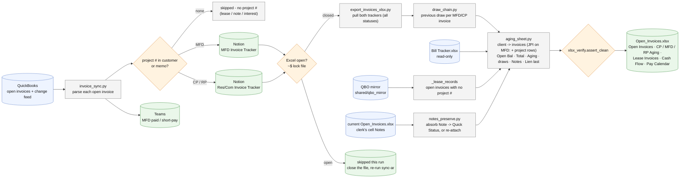

# invoice-sync/ - how the AR invoice sync and its Excel mirror work

Last changed: 10/01/2026 - the aging tabs show Open Balance + Total Amount after Due Date, ONE Aging
column and the lien columns last, client -> invoices (JPI on MFD keeps project rows); new Lease
Invoices tab from the QBO mirror (open invoices with no project #).

Update this chart - and the line above - in the same commit as any change to `invoice-sync/`
(`.github/flow_guard.sh`).

