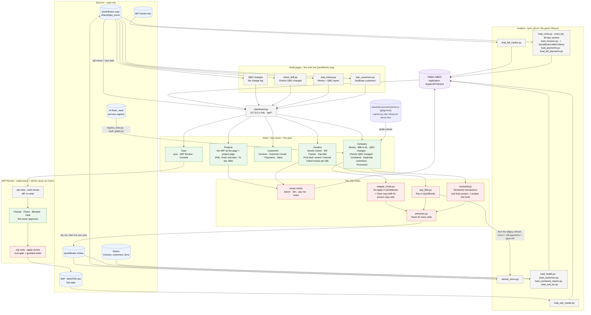

# ledger/ - how the Project Ledger works

Last changed: 10/07/2026 - process guides show people's names from `names.js` beside them in the vault's assets/processes/ (gitignored, the owner types the names once; every guide fills each role with its name). The ledger inlines it when it serves a guide (`registry_view.inline_names`); the guide on disk stays roles-only; Guide opens the html first when it has name slots. Earlier the same day: the bill payment stub drops the date under its title (Payment date is top right) and both stubs carry a divider above a full-size Amount. Earlier the same day: the stub column picker shows the stub's own labels (Open balance · Paid · New balance) and the vendor stub prints exactly the ticked columns. Earlier the same day: vendor page **Print stub** offers a **Vendor stub** (partials as columns: Open balance - Paid = New balance, no sentence) or an **Internal stub** (`bill_payment_stub.py` kind=internal: client + Joint check in the header, the client invoice(s) the money came from on top - a joint check matched to the client's Payment by date + amount - then the bills as Open balance - Paid = New balance; filed under `<vendor>/Internal/`); every print refreshes the mirror first, and a payment the mirror lacks also reloads bill payments and retries. Earlier the same day: process guides show people's names: a guide's `data-role` name slot is filled from the gitignored ROSTER.md when the ledger serves the page (`registry_view.roster_names` / `fill_names`; the file on disk stays roles-only; Guide opens the html first when it has slots). Earlier the same day: Company -> **Reclassify transactions** (`reclassify.py`, was one-offs/move_project_lines.py): preview every cost line on a project, tick lines, optional cost-code swap, Are you sure + Touch ID, then line-level writes (customer + the line's Projects tag), each document re-read live, backed up and proven after the write. Earlier: 10/06/2026 - sync-all stands down on AP + AR when Accounting/_automation/writer.json says "server" (the office server then owns them); the mirror refresh and the ledger reload still run here. Earlier: 10/06/2026 - Checks QBO changed splits floating checks into **Clear copy (mirror)** (tick and write in bulk) and **Hunt down**. **Clear copy**: the checks with a proven copy from before QuickBooks stripped them, fixed in bulk (`reapply_check.annotate` / `bulk_dry_run` / `bulk_commit`, one Touch ID per batch). Earlier the same day: gross billed tells retainage lines by the account the item posts to (Retainage Receivable), so a PC00 'Retainage' invoice is income, as in the project P&L. Earlier: 10/01/2026 - vendor page round 2: payment bills carry their scan count (📎); stubs open in the
Also, 10/01/2026 - `load_costs.py` maps every QuickBooks customer of a split-billed job (job rulings
`customers: all`, RP7401-FTW) to that one job; the Duplicate customers page no longer lists it.
Earlier the same day: vendor page round 2: payment bills carry their scan count (📎); stubs open in the
ledger; bills tick to copy. Earlier the same day: every bill row carries its QuickBooks memo AND due date from the copy (`MIR -> SRV`); the
Vendor Center's Unpaid view shows Due; its columns drag to a remembered order; the bill viewer's scan fills its pane.
Earlier the same day: the process registry moved out of the gear: Company -> **Processes**, grouped by area
(Accounts Payable, ...), plain process names, no registry codes. Earlier, 09/30/2026 - `refresh_mirror.py` also runs on the office server (docker/), where there is no Pay run to
watch. Earlier the same day: the bill viewer's pay status from the mirror; the viewer's job share + zoomable scan.

Update this chart - and the line above - in the same commit as any change to `ledger/`
(`.github/flow_guard.sh` fails the push otherwise). The full system map is `docs/ARCHITECTURE.md`.

