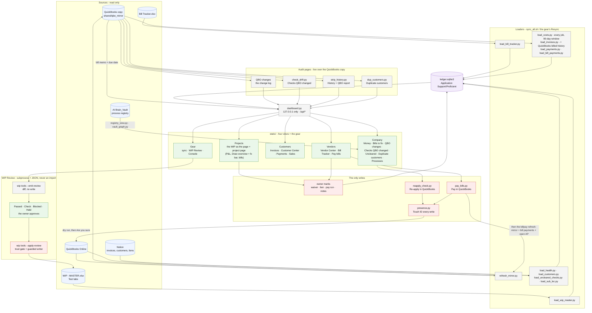

# ledger/ - how the Project Ledger works

Last changed: 10/01/2026 - vendor page round 2: payment bills carry their scan count (📎); stubs open in the
ledger; bills tick to copy. Earlier the same day: every bill row carries its QuickBooks memo AND due date from the copy (`MIR -> SRV`); the
Vendor Center's Unpaid view shows Due; its columns drag to a remembered order; the bill viewer's scan fills its pane.
Earlier the same day: the process registry moved out of the gear: Company -> **Processes**, grouped by area
(Accounts Payable, ...), plain process names, no registry codes. Earlier, 09/30/2026 - `refresh_mirror.py` also runs on the office server (docker/), where there is no Pay run to
watch. Earlier the same day: the bill viewer's pay status from the mirror; the viewer's job share + zoomable scan.

Update this chart - and the line above - in the same commit as any change to `ledger/`
(`.github/flow_guard.sh` fails the push otherwise). The full system map is `docs/ARCHITECTURE.md`.

