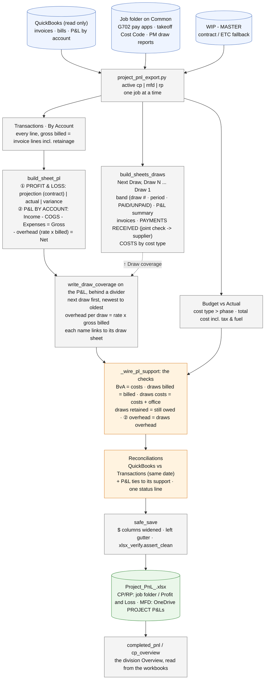

# project-pnl/ - how a job's P&L workbook is built

Last changed: 10/08/2026 - every draw sheet lists PAYMENTS RECEIVED under its invoices (check #, date, amount applied to that draw, invoice #, Paid to = To us or Joint check · <supplier> via shared/joint_checks), then TOTAL RECEIVED and STILL OPEN; the invoice and payment tables carry a full grid. Earlier: 10/06/2026 - a PC00 invoice whose every line is retainage by its own text, typos included (CP610 #32960 "REITANAGE"), is marked as retainage booked; the CP Completed book reads a non-project job's open invoices by the QBO ids its workbook links. Earlier: 10/06/2026 - Retainage still owed = what the GC has not PAID (held net of releases, never below 0, + open release invoices); new Retainage not billed yet (earned, not invoiced: pay-app retainage on net-draw jobs) on the P&L and as a column on the CP / CP Completed / MFD Overviews (hidden workbook names RetainageStillOwed / RetainageNotBilledYet). Earlier: 10/06/2026 - STATUS records the CP610 FINAL rebuild recipe (a non-project job: its GC as the parent, id 0). Earlier: 10/06/2026 - split billing (landed from 10/01 work): a job with a `customers: all` ruling (RP7401-FTW) pulls its invoices and costs from every QBO customer carrying its number. Earlier: 10/06/2026 - the P&L: Progress removed; the EXPENSES group only on a job that has expenses; under the draw TOTAL a thick rule, the Next draw (costs only) and a To date row whose gross profit = the P&L's actual Gross Profit; PC00 retainage invoices recorded (RetainageIncomeDocs) so a later release is not billed twice. Earlier: 10/06/2026 - Transactions: invoice memos wrap, the invoices fold under INCOME, the cost lines open folded under their vendor, category bands and subtotals drawn as blocks. Earlier: 10/06/2026 - credits reduce job cost: vendor credits are pulled and card credits negated (shared/qbo_costs.with_credits), each listed as its own transaction (Paid? = CREDIT) and netted into every total; invoice lines are retainage by the account their item posts to (Retainage Receivable), not by the word; a combined draw is date-cut per invoice on Reconciliations. Earlier the same day: a legacy job's QuickBooks income on Reconciliations is invoices at total + retainage held, through the P&L's end (was net billed, no date cut); one-offs/pnl_qbo_gap_trace.py traces any Reconciliations gap to its documents. Earlier, 10/02/2026 - the P&L checks add the billing OUTSIDE the draw table (untagged and pre-period invoices, releases outside every window, unplaced not-billed retainage), and Next Draw shows only untagged invoices dated after the first draw window. Earlier the same day: the CP Overview no longer takes retainage releases out of billed a second time (CP585 / CP672 / CP861 read short by their releases; verified against QuickBooks after). Earlier the same day: the workbook redesigned with the owner (rounds 1-23): the P&L sheet is ① Profit &
Loss beside ② P&L by account (current), then the draw coverage behind a divider; one sheet per draw in the
section format; the P&L checks joined to the Reconciliations tie-out; $ on every dollar figure. Billed is
GROSS (retainage included) and every to-date overhead is rate x billed - only the projection uses the contract
(`tests/test_pnl_layout_rules.py`).

Update this chart - and the line above - in the same commit as any change to `project-pnl/`
(`.github/flow_guard.sh` flags the push otherwise).

## The rules the numbers follow

| Figure | Rule |
|---|---|
| Billed | GROSS: the invoice lines including retainage held; a retainage release is collecting, not billing |
| Overhead, projection | rate x contract (10%; MFD also 9%) |
| Overhead, to date | rate x gross billed - ① Actual, ② by account, every draw |
| Draw gross | net billed + retained |
| Checks | every one must read ✓ on Reconciliations; a ✗ names the sheet that disagrees |
