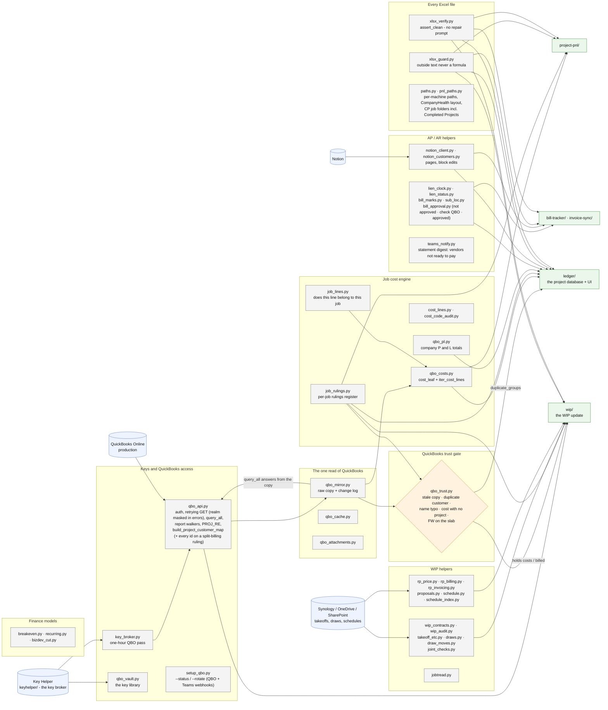

# shared/ - how the common package works

Last changed: 10/09/2026 - NEW `statement_record.py`, the ONE vendor statement record the ledger reads (written by statement-reconciler after every live run: `<Vendor>/.statement-record.json` + `.marked/` page PNGs; `root()` names the Vendor Statements folder for both tools, `key()` folds a vendor name to letters + digits so the Bill Tracker's spelling meets QuickBooks', `build` / `write` / `read_all` / `find` / `resolve_file` - a served path must sit under the vendor's folder). Earlier: 10/08/2026 - `joint_checks.py` pairs in three steps: check # + amount (any date), same date + amount, then the amount alone within 45 days when it is the only pair on both sides (a client check with no # - Van Brunt); a deposit to the Joint Checks account with no payment out yet is still a joint check, AR's memo says who. Earlier: 10/08/2026 - NEW `joint_checks.py`, the ONE joint-check rule (moved out of ledger/bill_payment_stub.py when the project P&L needed it): a client Payment into the Joint Checks account pairs with the Joint Checks BillPayment of the same check # + amount (any date - they are entered up to 23 days apart), else the same date + amount. Earlier: 10/08/2026 - NEW `bill_approval.py`, the ONE bill-approval rule (paper-era NOT APPROVED memo tag; a bill entered since 09/16/2026 and unpaid = "check QBO", its approval queue is invisible to the API; else approved), moved out of bill-tracker/bill_rows.py when the statement reconciler needed it. Earlier the same day: `qbo_api` masks the QuickBooks company (realm) id in every error `_api_get` raises (`mask_realm`: the `company/<id>` path, a requests URL, a fault body; status + QuickBooks message kept), and `setup_qbo --test` masks it in the company-probe failure (`tests/test_qbo_realm_masked.py`). Earlier: 10/07/2026 - `setup_qbo.py --rotate TEAMS_WEBHOOK_PAYMENTS` stores the payments channel webhook (QuickBooks payment received cards, invoice-sync). Earlier: 10/06/2026 - qbo_costs pulls vendor credits and negates card credits (with_credits); each is a negative cost transaction, so every cost total nets it. Earlier: 10/06/2026 - `xlsx_verify` fails a dropdown (data validation) rule Excel would strip behind a repair prompt: an intersection space, a union comma, a `Table[Col]` reference or over 255 characters (`tests/test_xlsx_verify.py`). 10/02/2026 - `qbo_vault` on Linux also reads MIRROR_KEY from the environment (the office server's mirror
failed without it). Same day: `xlsx_verify` accepts a freeze on BOTH rows and columns when it is written the way Excel
saves it (three selections, the main one inside the scrolling pane); openpyxl's bare default is still rejected
(`tests/test_xlsx_verify.py`). Earlier the same day - `pnl_paths._find_awarded_cp_folder` matches a finished job's folder on its name as
written ("CP656 - 77 PAUL WILSON" was lost when the spaces were squeezed out and the street number glued onto the
job #). Earlier, 10/01/2026 - `qbo_vault.has_credentials()` on Linux checks only the four QBO keys (JT_GRANT_KEY is
optional; the office server has none). Earlier, 09/30/2026: NEW `qbo_trust.py`, the QuickBooks trust gate every WIP write passes
Also, 10/01/2026 - **split billing**: a `customers: all` job ruling (`job_rulings.all_customers`, first case
RP7401-FTW, invoiced to two builders on purpose) makes `build_project_customer_map` carry every customer id
(`ids`); `customer_ids` / `report_customers` give the readers all of them (QBO reports take a comma list,
`fetch_customer_invoices` an `IN`), and `qbo_trust.duplicate_groups` drops the job - it is not a duplicate.

Earlier: 09/30/2026 - NEW `qbo_trust.py`, the QuickBooks trust gate every WIP write passes
(duplicate customers, name typos, costs with no project, flatwork on the slab, a stale copy). It
also owns `duplicate_groups`, which the ledger's Duplicate customers page reads. Same day: `pnl_paths`
finds a finished CP job's folder under `Completed Projects/<year>/` (active awarded folders first). Same day: `notion_client.py` keeps only the block edits the statement reconciler's Notion board uses (append / delete children, read a data source); `teams_notify.py` posts ONE statement digest card per run - since the evening of 09/30 it lists only the vendors NOT ready for a pay run (a line each + a count of the ready ones).

`shared/` is the ONLY importable common code (repo rule): a tool imports from here, never from
another tool. Update this chart - and the line above - in the same commit as any change to
`shared/` (`.github/flow_guard.sh` fails the push otherwise).

