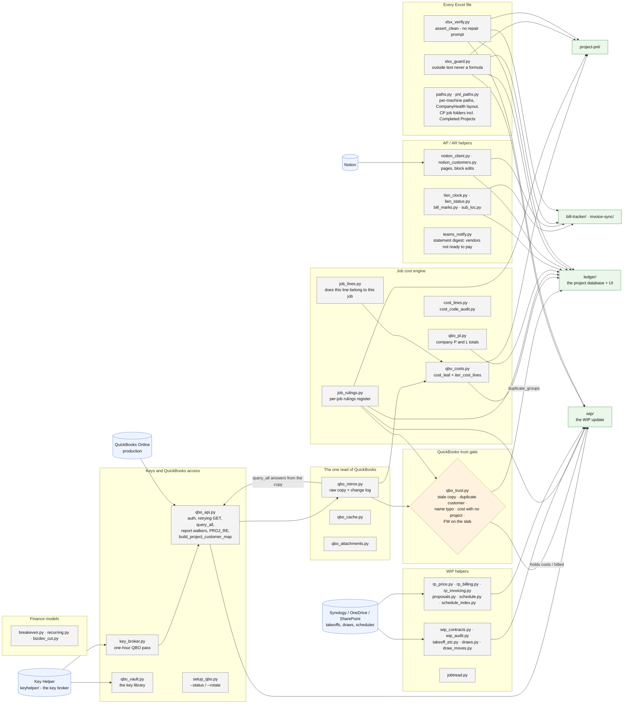

# shared/ - how the common package works

Last changed: 10/02/2026 - `pnl_paths._find_awarded_cp_folder` matches a finished job's folder on its name as
written ("CP656 - 77 PAUL WILSON" was lost when the spaces were squeezed out and the street number glued onto the
job #). Earlier, 10/01/2026 - `qbo_vault.has_credentials()` on Linux checks only the four QBO keys (JT_GRANT_KEY is
optional; the office server has none). Earlier, 09/30/2026: NEW `qbo_trust.py`, the QuickBooks trust gate every WIP write passes
(duplicate customers, name typos, costs with no project, flatwork on the slab, a stale copy). It
also owns `duplicate_groups`, which the ledger's Duplicate customers page reads. Same day: `pnl_paths`
finds a finished CP job's folder under `Completed Projects/<year>/` (active awarded folders first). Same day: `notion_client.py` keeps only the block edits the statement reconciler's Notion board uses (append / delete children, read a data source); `teams_notify.py` posts ONE statement digest card per run - since the evening of 09/30 it lists only the vendors NOT ready for a pay run (a line each + a count of the ready ones).

`shared/` is the ONLY importable common code (repo rule): a tool imports from here, never from
another tool. Update this chart - and the line above - in the same commit as any change to
`shared/` (`.github/flow_guard.sh` fails the push otherwise).

