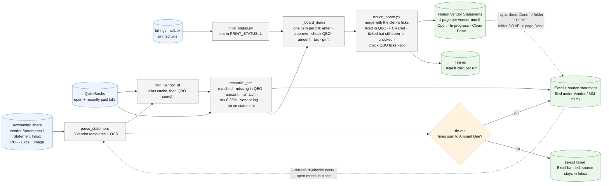

# statement-reconciler/ - how the vendor statement reconciler works

Last changed: 09/30/2026 - follow-up moved from a Teams card per vendor-month to the Notion
"Vendor Statements" board: one live checklist page per vendor-month, rewritten every run, and
one Teams digest per run.

Update this chart - and the line above - in the same commit as any change to
`statement-reconciler/` (`.github/flow_guard.sh`).

