# statement-reconciler/ - how the vendor statement reconciler works

Last changed: 10/09/2026 - statement invoice # pairs with the QBO Ref # ignoring case and spacing, then a clerk's suffix ('401417-CC FEE') when exactly one bill carries it.
Earlier 10/08 (late) - notes typed on Notion under the bill (read back each run, shown read-only in the Excel); Notion "Re-check" box -> `--from-notion` poller (run_recheck.sh, launchd every 5 min); "Excel" link to the vendor folder (File Station - TRANSITION to SharePoint).
Earlier 10/08 (night): bill approval in three states from `shared/bill_approval` (NOT APPROVED memo · check QBO for bills entered since 09/16 and unpaid · approved) in the Excel, the marked statement and Notion.
Earlier 10/08 (evening): the workbook is Summary + Statement (marked) only (Statements /
Changes live on Notion); colour key to the right of the pages; columns Finding / Notes.
Earlier 10/08: marked-up statement, OCR for scanned statements, new layouts, safety nets, `--audit-parsing`.
10/07: one running record per vendor.

Update this chart - and the line above - in the same commit as any change to
`statement-reconciler/` (`.github/flow_guard.sh`).

```mermaid
flowchart LR
    classDef src fill:#eef4ff,stroke:#5b7fc7,color:#111
    classDef tool fill:#f4f4f4,stroke:#777,color:#111
    classDef gate fill:#fff3e0,stroke:#d9822b,color:#111
    classDef out fill:#eaf7ea,stroke:#3c8d40,color:#111

    INBOX[("Statement Inbox<br/>PDF · Excel · image, any order")]:::src
    FILED[("&lt;Vendor&gt;/Current + History<br/>(old MM-YYYY folders folded in)")]:::src
    QBO[("QuickBooks<br/>open + recently paid bills")]:::src
    MBX[("billings mailbox<br/>printed bills")]:::src

    ID["identify_file<br/>parse (~16 layouts + OCR) + vendor<br/>(alias cache, then QBO search;<br/>several matches = refuse, never guess)"]:::tool
    TIE{"safety nets per statement<br/>lines sum to its Amount Due?<br/>dated, not before its own invoices?"}:::gate
    AUD["--audit-parsing<br/>every statement on the share,<br/>read-only, after any parser change"]:::tool
    SET["statement_set.plan<br/>duplicate (same file) · unreadable ·<br/>merge by invoice-date range:<br/>full list / past-due letter / activity"]:::tool
    MERGED["ONE open list as of the newest date<br/>+ 'statements disagree by $X' when the<br/>vendor's own documents differ"]:::tool
    NOTES["clerk notes<br/>read from the Excel before rewriting,<br/>kept by bill id in .reconciler.json"]:::tool
    REC["reconcile_vendor<br/>pair by Ref # (case/spacing ignored,<br/>then a unique clerk suffix)<br/>matched · missing in QBO · amount mismatch ·<br/>tax 8.25% · paid but vendor shows open · not on statement"]:::tool
    MARK["statement_markup<br/>find every line on its page (PDF words / OCR),<br/>band it in its bucket colour;<br/>a bill-looking row with no band = NOT READ"]:::tool
    PS["print_status.py<br/>opt-in PRINT_STATUS=1"]:::tool
    NB["notion_board.py<br/>merge with the clerk's ticks; a count per bucket;<br/>fixed -> Cleared"]:::tool
    PREV{"--dry-run?"}:::gate

    XLSX[("&lt;Vendor&gt;/Current: statement(s) in use + ONE Excel<br/>Summary (Notes col) · Statement (marked)")]:::out
    HIST[("&lt;Vendor&gt;/History<br/>'mm-dd-yyyy DONE / Replaced / Duplicate - file'")]:::out
    HELD[("unreadable statement:<br/>stays in the Inbox / Current")]:::out
    PAGE[("Notion · 1 page per vendor<br/>All entered as of &lt;date&gt; · Not entered · Unreadable · No statement<br/>To do · Changed since · Statements · Cleared")]:::out
    TEAMS[("Teams<br/>1 digest: vendors not ready to pay")]:::out
    PRINT[("terminal: the plan per vendor<br/>+ what would be filed + board preview")]:::out

    INBOX --> ID --> TIE
    FILED --> TIE
    QBO --> ID
    TIE -- yes --> SET
    TIE -- no --> HELD
    FILED -.-> AUD
    SET --> MERGED --> REC
    QBO --> REC
    FILED --> NOTES --> REC
    MBX --> PS --> REC
    REC --> MARK --> PREV
    PREV -- yes --> PRINT
    PREV -- no --> XLSX
    PREV -- no --> HIST
    PREV -- no --> NB --> PAGE
    NB --> TEAMS
    RECHECK{"Notion 'Re-check' ticked?<br/>run_recheck.sh every 5 min<br/>(silent when locked / nothing ticked)"}:::gate
    PAGE -. "clerk ticks Re-check · types notes under bills" .-> RECHECK
    RECHECK -- yes --> TIE
    XLSX -. "--refresh re-checks every vendor's current statement(s)" .-> TIE
```

