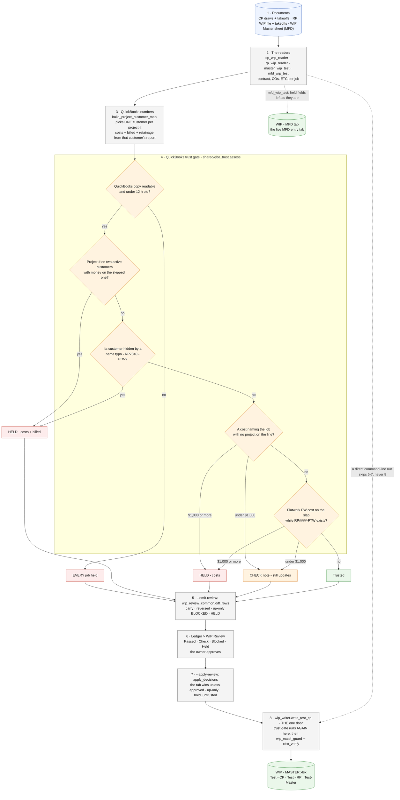

# wip/ - how the WIP update works

Last changed: 10/02/2026 - the CP reader falls back to the signed pay app (shared.draws.read_pay_app, .xls included) when a job has no .xlsx draw workbook; CP831's Draw #2 change order (33,361) now reaches the WIP Review. Earlier: 09/30/2026 - the **QuickBooks trust gate**: before any costs / billed number is
overwritten, `shared/qbo_trust` checks the job is booked cleanly in QuickBooks; a job that is not
is HELD (the tab keeps its number, a new job is not added) until the reason is fixed.

Update this chart - and the line above - in the same commit as any change to `wip/`
(`.github/flow_guard.sh` fails the push otherwise).

## What each result means

| Result | What happens to the number | How it clears |
|---|---|---|
| **Passed** | Goes up: written when approved | - |
| **Check** | Went down / blank (retainage), or a finding under $1,000: the owner's call; the note names the documents | Fix in QuickBooks when convenient |
| **Blocked** | Costs / billed went DOWN: never written, the tab keeps its number | Find the voided / deleted / re-coded line in QuickBooks |
| **Held** | QuickBooks not trusted for this job: never written, the tab keeps its number; a job not yet on the tab is not added | Fix the reason in QuickBooks (make the duplicate customer inactive, rename the typo, put the project on the line, move FW to the -FTW job), refresh, compute again |

The gate fails **closed**: if the QuickBooks copy cannot be read, or is older than 12 hours, every
job is held and nothing is overwritten. The ledger's **Company > Duplicate customers** page lists the
same duplicate / typo findings the gate holds on (one shared function, `qbo_trust.duplicate_groups`).
